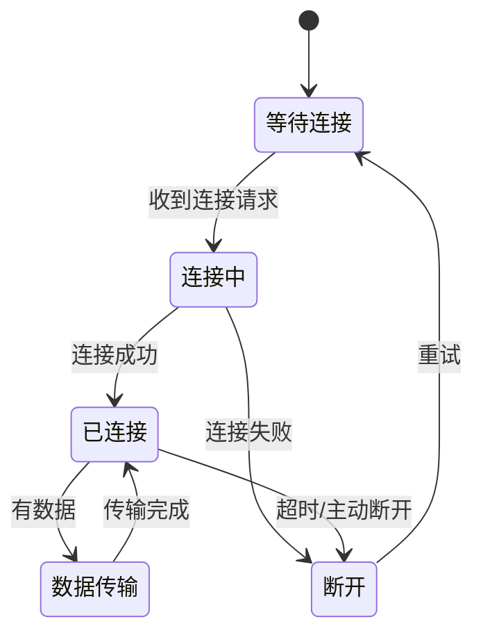

# 深度挖掘——coding & feature - 知识梳理

## 涉及的技术栈/工具

- **思维工具**：Mermaid状态图、流程图
- **调试方法**：控制变量法、分层调试
- **项目管理**：Obsidian + SPEC/PRD文档

## 关键概念与方法

- **Vibe Coding**：用AI生成代码但缺乏底层理解
- **狐狸vs刺猬**：广泛兴趣vs专注深耕
- **工程契约**：用明确的状态定义约束AI行为
- **即时反馈回路**：追求多巴胺的学习模式

## 重要的代码片段或命令

## 参考资源

- [Gemini Chat](https://gemini.google.com/app/c21b97afca1515db)
- AstrBot GitHub (15k stars)

## 可复用的经验/最佳实践

1. **用状态机思维处理边界情况**：将AI的不确定性转化为确定性状态
2. **用Mermaid图作为"契约"**：在写代码前先定义状态转换
3. **狐狸型人才的定位**：跨界连接者，而非单一领域深耕者
4. **工程化设计流程**：SPEC → PRD → 实现，而非边写边改
