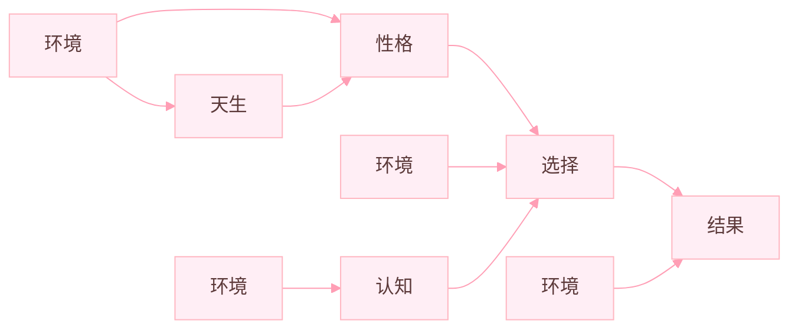
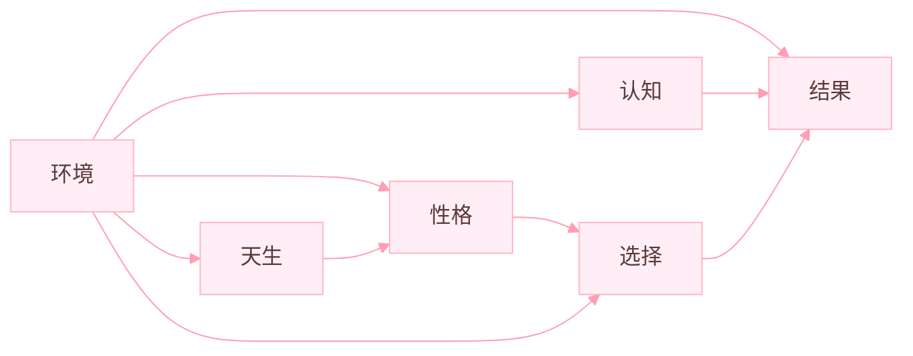

## 2023-08-09
第一篇周记，坦白地说，我不知道该写什么好，我的语言表达能力很差，我会尽我所能传达出我的想法。

记得您在谈到品德高尚时，说控制欲望或是一些邪恶的想法即为品德高尚，想想似乎没什么毛病。而在此之前我常以产生过邪恶的想法而自我羞愧，不过以后我想我能正视它们了。

上您的语文课实际上相当不错，通过您的语文课我的的确确可以从中学到很多书本之外的东西，相比于硬塞理论知识，这样才算是有意义的语文课。

就我而言，我上了高二之后，更多地感到的是迷茫，我读的书少却又爱胡思乱想，最终也是白白浪费精力。至于迷茫，我也说不清楚，学习的过程好比在一条不知在何处，更不知通向何处的路上奔跑，像休息但望向周围的人，他们一边跑一边口口声声说他们已经休息很久了，尽管他人的行为不应该影响我的想法，可我还是很迷。

最近有一个疑问，就是即便我放了学回去立马洗洗睡觉，第二天早上上课还是会困，而也有相当一部分人，他们晚上乃至中午，休息时间都可以算是较少，上课却永远精神饱满，从不困乏。这是体质问题还是精神问题？对于所谓的困，我觉得如果面对的是真困，是毫无反制机会的，无论是站着，蹲着，抑或是风油精，都无济于事。而我也常常因此困扰，可能是睡眠质量不佳造成的吧。

......经过几天的摸索，这个疑问已经被我解决了，睡眠质量才是最重要的！

**师评：** *什么事情都是质量优于数量*

## 2023-08-16
该周唯一能写的或许只有那可怜的一点假期。

其实于我而言，放假逐渐变得不那么重要了，更多地我感觉是浪费时间，并不是说我有多喜欢在学校学习，只是在家里的环境中，我的精神状况相对较糟糕。游戏大多也都玩腻了，如果仅是无意义的打游戏刷视频消磨时间，在此过程中我是麻木的，但当我真正意识到我做了什么后，我收货的不是开心和满足，而是负罪感。
即使在那过程中是有开心愉悦的成分，但就结果来看，这并不是我想要的。而在之前，我玩了之后并不会感到负罪，也认为值得，究竟是什么改变了我的观念呢？

还有一个就是我发现自己愈发地没干劲了，青少年的朝气在我身上根本看不见，换言之，我有些无欲无求了，很多事情在我眼里似乎都无所谓了，感觉自己在某方面人还年轻，心却已老。究其原因，可能缺乏明确的目标算是一个，其次观念上的看开也是一个。

好了，暂且谈到这里吧。

## 2023-08-26
其实我是一位魔方玩家，自进入这个魔方这个圈子也有大半年了。我在掌握了 CFOP （一种复原方式）后，逐渐地体会到魔方其本身的乐趣。在高二下学期那会，由于过于沉迷其中，导致成绩有所下滑，母亲就开始对我所玩的魔方有了一定的偏见，她认为魔方是个很无聊的东西，整天哗啦哗啦的有啥好玩的。作为一个外行且更年期的女性，这样想没什么错，但时不时的富于偏见的话语令我烦恼。魔方对我而言有着特殊的意义，我明确地可以从中收获快乐与成就感，也可以结交很多的朋友，而非仅仅出于新鲜感去把玩。不过啊，在当前紧张的学习中，过于沉迷是不好。记得罗翔有言，毁掉你的往往不是你讨厌的东西，而是你热爱的东西，过于痴迷只会让当前的我断送前程。

其实魔方并不是所谓的死记公式，然后靠一些手速就能玩会，它也是需要理解和运用，同样有举一反三，易混辨析等。在实际的复原过程中，不仅需要极强的追踪观察能力于预判猜测能力，更需要大脑飞速运转对当前状态进行分析，以得出最优解法并不断修正路线而优化后续步骤，与此同时还要灵活手指配合与高速转动手腕的能力，以及大量公式的储备和反复的练习，像我目前所使用的 CFOP，仅基础公式就近 100 条，短的几步，长的 20 步。至于进阶的，可以优化 CFOP 中的 OP，即 ZBLL，有 500 多条公式。实际上，无论是什么，作为外行能看见的只有冰山一角中的一角，深入了解后才能明白看似容易的一件事真正做好有多困难。

## 2023-08-27
这周我来谈谈关于我短视频的使用感想。

最初是从 QQ 看点开始吧，那时其实主要还是文章为主，基本上都是标题与评论区永远比正文好看，其中也是有一些短视频。后来才接触快手抖音之类的，我抖音只在以前用过1,2个月，主要是快手。那个时候还在玩农药，关注了好多主播学习操作，态度不亚于我学习时，之后随着水平的提升，逐渐自己开始尝试发布视频，当时发的都是技术视频，少的几百播放，最多的有十万播放，然而最高播放的却只一个娱乐视频，近九十万播放，一下就给我涨到三千粉，粉丝多了之后，看的人就多了。再之后，农药玩得少了，忘了是哪天脑抽给自己视频都删了，快手也基本不用。

大约是从高一起，进了 bilibili，原先用快手还没感觉到啥，用了 b 站才明显感觉到差异，仅从评论区用户的发言就能清楚地知晓用户的年龄段与脑子有无。而 b 站的视频质量相对也高一些，觉得真的不与某手某音同列。然后一直用到现在也是感觉良好，直至前不久，我也尝试成为一名 up，发布与魔方有关的视频。同学说想有流量就得靠蹭热度，标题党等方式，但我现在发布视频不追求热度，当然能有一些也会开心。我主要还是为了记录自己，图一乐吧，都进魔方圈了不指望有啥热度。

## 2023-09-06
开学刚一个月，周记便忘记写了，其实早在周日自习，以及周一就有过写写周记的想法，但一方面因为实在没什么可写，另一方面有一些拖延症，一直拖写完语文试卷才写，在这里也向您道歉。

事到如今呢，也多少有了些事情可写，那就是早上的固始县高级中学 2023 表彰大会，头一次进入学校的大礼堂，挺大的，活动的主体即诵读 xx 之星学生名单，以及校长讲话，前面将近读了有三四百人的样子，感觉这学校颁发荣誉好随机的样子。至于张校长的讲话，那可真是接地气，没有任何架子，不过呢，也能明显感到校长对学生学习的关注。尽管有时会因为假期而对校长不满，但站在他，以及整个教育部门的角度，成绩在我们这个地方始终是最重要，清华能考多少才是第一，学生假期有多少也仅仅只有学生关心，当然与此同时老师们也被牵连地难有休息。不过在两年的洗礼后，我心态也好了不少。放，不放都好。在校，能与同学相处是一乐趣，回家，能领略互联网风趣又是一乐趣。尽管两者存在非乐的成分。总之，我已经不再认为学习是煎熬，与刚开学那会相比迷茫少了很多，能让自己活得更从容些了吧。

## 2023-09-13
身处同一个班级，总觉得实力有着天壤之别，多次怀疑我是如何考进这个班级的，常常心有余而力不足。我只得调好心态，降低期待，减少焦虑，才得以适应这个环境。

我并非是一个十分勤奋刻苦的学生，刷着小聪明而自以为是。我更倾向于高效学习，在较少的时间里完成更多的事情，在学校不同的精神状态与时间尺度适合着做不同的事情。课间适合出去提神或利用碎片化时间完成练字类作业，而晚自习第三节自习之类更适宜做理科题，中午呢，当然是用来睡觉的（bushi）。不过中午在刚吃完饭教室里舒适的空调环境中，我真的很容易犯困，一旦趴下就起不来了。身在五楼，每每吃饭都会因此错失良机慢人一步。我实在觉得慢悠悠地走去吃饭是很没有意义的，它会增加你排队的时间（甚至可能吃不到饭），有什么话拿到饭在手再说也不迟，尤其是我习惯了一个人独享饭菜之后，吃饭不跑都不得劲。当别人刚踏进食堂开始在稠的人群中寸步难行之时，我已经拿好饭菜挑选位置了。怎么看跑去都是更划算（况且可以锻炼短跑与在人群中跑酷躲避障碍物的能力），遗憾的是我在高二下学期才觉醒这个意识。

**师评：** *不迟*

## 2023-09-21
现在是北京时间一点零三分，六场考试一晃而过。

与结果相比，我更好奇的是为什么一部分人在考完之后到处向别人宣扬自己错了哪些题，有多寄，我不随意揣测他们的动机，但是对我而言，我既不会安慰，也不会去同情，并非是因为我考的有多好，我平日里所做的努力和学习态度配得上一个怎样的成绩我也清楚，对于那些人的“哭诉”，我能如何回应？不作回应？阴阳怪气马上就来，我说我也考差了？比惨大会马上开始，真是很难理解，考好了恶语相对，考差了说你放水，我并不认为那些脏话是开玩笑，总而言之，目前的学习氛围，不，说风气更合适一些，多少有些令人寒心。

自从规定了作为的格式等要求，我却更好写了些。高一高二真的都是文无定法随便写，总是为了凑字数讲废话，采用规定的格式后，却是在心里盘算着如何控制不写多，写起来可以说是容易多了。

## 2023-09-27
现在是周二晚八点五十九分，决定在晚三解决周记是出于写作业写麻了，在这样一个繁重的学习任务下周记与其说是一个负担，倒不如说是一个放松的方式，此刻想法不受题干限制，我所写下的即是我想的。

高一高二我被刘老师和霍老师教授语文学习，那两年的文言文背诵其实都仅限于原文会背即可，课下重要注释只有霍老师抓的紧些，有时提问，而至于全文翻译，我可以说是几乎没有接触过，加上那些注释我背得并不熟并忘了大多，以及语文素养较低，造就了我目前在背，或者说理解课文含意上有一定的困难，在不注重翻译前，很多课文原句说实话我根本不知道什么意思，也仅靠肌肉记忆背住了原文，因此我想我接下来在这当面还得下更多功夫。

至于前不久月考的语文成绩，我个人相比高二是觉得有较大提升。高二那会语文一千名开外都是家常便饭，令我不解的是在此之前我高一的语文却算得上比较好，至少不会拖我后腿。因而我们常常调侃语文就是个“玄学”，时低时高，让我犯难其实还在语文的选择题上，如若不是题特别容易，我都很难把握自己对选择项的思考程度，要么想多，要么想少，更多的还是在两个选项间纠结然后屡次蒙错，这也是我为何这次语文选择错了一半（4个）的原因，很多情况下靠我个人的情商与价值判断果断做出的选择都是错......

**师评：** *还是需要多接触社会 你觉得呢？*

## 2023-10-07
我觉得吧，我我放假无法投入学习已经成为习惯了，换句话说，一个好的学习环境是我学习效率的保证，毕竟我从未拥有一个意志力坚强的内心。究其原因，我想有以下方面：
1. 就是在放假时远有比学习更有意思的事情去做，因而将作业和网络摆在我面前，我会毫不犹豫地选择网络，即使我知道在那种情况下认真学习在将来能够带来的收益一定比沉迷网络要多得多，但想了想，在当时学习是无法及时得到反馈的，除了无聊还是无聊，而网络能实实在在地让我当时就收获快乐。不过话说回来，还是那句“学海无涯苦作舟”啊。
2. 是我缺乏足够的驱动力去促使我学习，驱动力可以来自于短时对成绩、排名的追求，也可以来源于所谓的对梦想的执着。而我没有后者，前者给我的力量少之又少，我渴望取得一个好成绩，但目前它还不足以能让我沉下心来学习。
3. 是习惯的形成，打小我就与网络紧密接触，一直以来都贯穿着“劳逸结合”的原则，很难一下子去全身心投入学习。

或许我需要一个沉重的打击才能改变学习态度？或者说，对于态度的转变本身就是一个顺其自然的过程呢？

## 2023-10-11
在经过一些“终日而思”后，我认为我或许可以尝试改变部分学习方法的策略。比如将原本回家写作业替换为温习需要复习、背诵的知识点。因为考试考的是对知识点的理解与掌握，而不是作业写的多不多、快不快。在一轮复习阶段，每天都有很多东西要记，单凭写作业只能记住一点点。而作业呢，只要不抄，早晚都要写。至于刷题，坦白说如果无脑去刷，只是浪费时间，毫无疑问需要从中归纳经验。但事实上平时的作业也是一种刷题，及时温习的话再挤时间刷课外资料似乎意义不大，所以我想着目前应脚踏实地，不急不躁地学习。又一个原因是在校实际上留给自己背书温习的时间真的算是很少，且于我而言是低效的，我向来在早读，午读人声嘈杂的环境中记忆效率低下的，不仅易困还记得慢。相反回家后夜深人静的氛围之下我记忆更显高效，（据说一夜的睡眠会加深记忆效果）。记的高二背过秦论好几个早自习只背下来一段半，然后被提问不好，于是要下次重找老师背，回家连夜把剩下几段硬是背下来了，所以我认为此方案值得一试。

## 2025-10-18
”卷死了......“无数次听到这种类似的话语常常令我心生厌恶。我几乎不向他人说这种话，同样也反感这种现象，听到您关于此的一些看法后，我深有共鸣。内卷化氛围下，不少人心态的确出现问题，明明自己无能摆烂，却要将他人的努力学习视作内卷，而此行为也大多表现在某方面比自己优秀的学生上，无论是哪方面，总能找到所谓的”破绽“然后说出某句话以排解心中不安。从另一个角度看，被说的学生有时会想”自证“，证明自己不是口中所说”内卷“，但这难以成功，让你掉入自证的陷阱中，并处于慌乱或许同样是语出者的目的之一。所以说面对这种我都懒得给予回应，我也不想让自己被激怒。

上周写到我选择改变学习策略——回家复习知识点，但真正实行起来还是离不开一颗意志坚定的内心，习惯这种策略还需一定的时间，想到这里我有一句感悟，”改变是痛苦的，同时也是值得。“

......

还有几天就要实行市级联考了啊，我觉得面对大型考试，可以努力复习，但必须要稳住心态，切不可心里总想着”好多都没复习到，急死我了“之类的，上次月考前一天晚自习我在开始并不想复习，或者复习效率低，心不在焉，就去把作业往后写，提前预习，同学也对此感到不解。写了好久便有了复习的想法，也是很快进入状态，最后成绩也算满意把，因此此次大考我同样会这么做，心态文章永远第一，考试的大概成绩区间完全取决于平时的学习态度和学习状态。

## 2023-10-25
现在是刚考完试的下午，不谈考事。

我想了一想，除了考事似乎真的没有什么可说的，整天都待在学校里，准确来说是这间名为 45 班的，几十年来的教室里，”世界这么大，我想去看看“，每当网络上冲浪时都会不禁发出感叹，世界上原来如何丰富，山外有那么多山，人外也有那么多人，我的存在似乎的确可以忽略不计。但是主观上我并不甘心被忽略不计，我虽不愿与他人比较，不愿困于名为”活过他人“的牢笼中，却也想变得独特，活出仅属于自己的精彩与不凡。

尝试思考了一会，知识的匮乏使我徒劳，”吾尝终日而思矣，不如须臾之所学也。“这句《劝学》中的话我还是非常认同的，思考一些学习之外的事情常常令我崩溃而毫无收获。只能说对于社会的接触还是太少太少的，而且打小吧，主要从初中开始，我就失去了很多接触社会的机会，每逢放假我除了游戏还是游戏。中考后的那个暑假我竟然一天高强度 10 个小时以上的手机使用持续了两个月，现在看来真是不可思议呢！因为现在突然就对那些游戏失去了兴趣。唯二我觉得有意思的娱乐方式是看番与魔方，哈哈。看番确实是某种意义上的猎奇，”想都不敢想的事情他居然能轻易做到。“常常欲罢不能啊，哈哈。

## 2023-11-01
周记本刚发下来我便着手写下一篇，为什么呢？因为我好多话想说。如果别人不找我聊天的话，我大概率就没人可说话了，我极其被动，好多次在路上遇见老同学，他们都能自然地询问我的状况等，我却想不起去关心他们，因为大多人与我的交情还没让我关心他们的程度，但这似乎不重要。人际交往讲的是礼，问候仅仅出于礼貌，可能并不需要关系有多么好。

此外是对考试的小总结，结果比想象的要好，尤其是语文，名次与前相比呈指数式上升，该说不说老师您的教学真是厉害呢，虽然主观题我答得一般，但就作文而言，与高一、二那会真的没法比，说句不该说的，我真不知道我高二从霍老师那学到了什么......然后是一个经验，成绩的好坏实际上取决是否有瘸腿学科，如果都不偏科，经过我的计算，即将每一科都控制在全班中位数的水平，总分也能轻易进校前五十，而那些校前 20，乃至前 10 的，并非全是某些科特别突出或拔尖而占据有时而是各科都维持在良好的水平。虽然上述结论中的轻易进 50 本身就接近于中位数，但各科都排于中位数可是大多数人口中的没考好。有一个忽视了的问题就是各个人标准都不一样，对我而言可能进前 50 就算可以，其他人就未必了。但是我想不少人还是存在优势学科的，然后因为某一科瘸腿而止步于更高的梯队，所以我想强调的就是各个学科当前当均衡发展，齐头并进！

......

周日复习总结课上，我仔细看了 汤xx 及评讲上的范文，天哪，阅读竟然有不小的困难，如同我做英语阅读时遇见生词与长难句一样，一度怀疑我有没有学过语文，真的感觉我被降维打击......

**师评：** *前途星光（）（）*
> 这里我没认出来后面两个字写的是什么......

## 2023-11-08
不知怎的，我的英语突然就变得更差，有些力不从心。
我并不认为这源于我的基础是否存在问题，可能主要因为我的做题习惯与思维方式出现了问题？即便投入 120% 的认证将粗心这一因素排除在外，我也还是做不好一卷，因而我常常产生困惑，甚至上升到愤怒，源于无能的愤怒。我尽量将其压至心底而避免影响别人以及自己的学习状态，到最后不免催生出一丝无奈与绝望。我的情感也只得在这宝贵的周记抒发。

想不明白，我真的想不明白。从错误中发现很大程度上的确是理解偏差，想多抑或是想少，前者占多数，这一点，在生物也有所体现，而硬性知识的加持使其不那么严重。

有着强烈改变这一状况的渴望，我却无从下手，无论我如何花时间积累背诵词汇或是高度集中注意于做题，结果都是徒劳，没有什么比这更令人伤心，生气了。

算了，转念一想，人与人之间本就各有长短，家家都有本难念的经，我有我的苦恼，别人也同样会有各自的担忧。即使我的英语水平不如别人，我也同样能取得一个自己满意的总成绩，不是吗？取长补短，并不意味着要和短板死磕到底，我既然尝试做出过努力，没有结果就没有吧，睡一觉，第二天醒来，我还是一条好汉。

啊，写完周记心理可真是舒服多了。

## 2023-11-15
不谈别的，谈谈同学罢。最近有幸阅读 陈xx 同学的笔记，真可谓“有趣的灵魂万里挑一”，他周记的内容把我乐的哈哈大笑，从日常生活中来看，我觉得他才是真正看得开，至少他向外表现出的，都是正能量的情感，给周围人带来欢乐。怎么说呢，很羡慕吧，因为我想到自己有时总是想些不该想的，自作多情待人冷漠啥的，可能源于由先前的小圈子，开到目前稍大的圈子，我也会无法坦然接受自己的平凡与无能，算是一种落差感吧，对此我常常困扰。

其次，我的新同桌是 xx 。初中九年级是在我隔壁，那时就早有耳闻，一个“无论多难的数学试卷都能满分或是接近满分”的传奇人物。由于没有亲目见识，也未真正理解。然后，从周六的晚数培优中，我的下巴的确让惊掉了，我粗略看了下时间，他应该是一个小时没到就给写完了。我知道这个班里有很多厉害的大佬，但像这种降维打击我还是第一次见吧，实在是令人难以置信。~~（此处有大量涂改带）~~

高考似乎不远了呢。

......

吃饭时想了下，我对自己的性格困扰主要是在于我的畏首畏尾以及不善表达，这一次让我失去了很多接触其他人、事的机会。由于会在未行动前产生不必要的、多余的担忧，因而显得优柔寡断。记得以前的我比较单纯，还能有力地说出“我是自信的”，现在早已不行了，so，会试着作出一些改变，事情的后果没我想的那么严重。

随后，浅浅谈下昨日颁奖之典礼，不瞒你说，从典礼前的那一节体育课开始，一直到 5 点左右离开，其间 6 个小时左右的时间，魔方一直都在玩我，搞得我晚上头昏脑涨，有日薄西山之感，那个什么典礼和同学玩得还算开心，嗯......

## 2023-11-22
“你是理性的怪物吗？”当看到雪之下阳乃对比企谷八幡这样说时，我不禁陷入思考。回顾这集之前的剧情，我觉得所谓理性似乎并不能过度地追求。作为理科生常常认为理性就是应追求之物，但是过度追求后好像会变得很可怕，人毕竟是有情绪的动物，当人参与到事件之中，就不得不把感性包括在内。客观的优势在于客观，劣势也同样在于客观。俗话说“当局者迷，旁观者清：，可大多时候，旁观者清的那些，也仅仅是在”旁“的视角下清，当局者的的感受与经历自然是旁观者所难以理解的。”经历不同，何来感同身受。”因而旁观者依据所见的得出的观点很可能对当局者毫无意义，只有当局者真正改变自己的视角，站在旁观者之位上，才有机会、有可能找到事情的解决办法。因而若让旁观者以其客观理性的方式去给出解决方案，也许问题可以被解决，但很可能忽略了人内心的感受，只能尽量地去换位思考，以求一些共鸣和理解，这很那把？

我社会阅历贫瘠，上述仅是在观看影视作品后，以其故事情节为基础而感，然后从现实生活以自我为根据，似乎也能印证我的一些观点。

——观《春物》第 2 季第 4 集有感而发

---
“如果你们的关系那么容易破碎，那还不如让它破碎。”这是大老师（比企谷八幡）在与叶山交谈问题时所言。总是独来独往的大老师几乎没有朋友，或者是在那之前还未与朋友出现过难办的问题，在他看来，表面上的人际关系不如不维持，因而，他与叶山不可能相互理解。而在之后，他所重视的人即雪之下雪乃与他产生分歧后用了类似上面那句话回应他，那一刻，大老师的内心是震惊的，当事情真正发生到自己身上后，他才知道自己的错误认知。在我看来，《春物》，全名为《我的青春恋爱物语果然有问题》（实际和恋爱关系不大）看似是一部日漫，实际上可算作社会文学作品，里面的内涵过于丰富以至于不开弹幕完全看不懂，同时，这是迄今为止唯一一部我还没刷完就打算之后再看一遍甚至多遍，他的情节、人物、环境、主题，都值得细品。这下我才得以理解为何有那么多人喜欢《春物》以及其中的角色了。

——观《春物》第 2 季第 9 集有感

对了，春物第一季（动漫）是 2013 年的，那时龙哥在上大学吧？原作小说何时创作我不知道，把时间线向前推进一点，很可能龙哥或者是龙哥同学就看过呢。

**师评：** *没有*

## 2023-11-29
写“华人”作文写一半我把刚下发的周记抽出抒发即时感想，每次写这种与时代与中华传统文化等相关的我都感觉自己无论思想还是所作所为都与这个时代格格不入，可谓是真正的“俗人”，人文知识几乎零储备，一心不闻窗外事的我可能内心真的只想把自己的一生过得自在洒脱，有追求超然物外之感，那些“窗外之事”我可不愿关心，因为和自己真的关系不大或者是根本没关系。这是缺乏爱国精神的体现吗？我从未认为自己有过赤子之心。ok，继续写作文。

......

每到这种临近“放假”之际，谣言四起，我向来是不关心的，也不期望锢高能大发慈悲给我们正常放假，不放不太合适，放长了也不好，我觉得一天左右刚刚好。放假时虽然当时玩得爽，但假期一结束，便会有种空虚的，怅然所失之感。换言之，从长远来看，放假我的活动的意义是微乎其微的，即便在之后去回忆，也非一个愉快的结果。最无奈的莫过于我明知如此，仍被习惯操纵，清醒地堕落着。

最近的体育课我重拾羽毛球，距上次打或许已有六七年，我认为我还是相当喜爱打羽毛球的，羽毛球就像是更大尺度上的乒乓球，就如同柚子是更大尺度上的桔子一样（我一直觉得这俩水果真的好像），两人一球就能上演一场精彩的对战，打了近一节课，我与同学相比显得更不累些，可能我比较投入享受吧（我向来是几乎不运动的，除了吃饭前的百米冲刺，所以身体算是比较虚弱的）。

## 2023-12-06
假期真是简短！

已经不愿再费心思考那些无意义的事了，顺其自然，无论学习，还是生活。船到桥头自然直，对于自己考试成绩的失利，我仅把其归因于“水还未到”，则“渠也难成”。在校就专注些，保证质量和效率，假期呢，就安心放松不给自己施压，即做到“玩的时候好好玩，学的时候好好学”，即没学好也没玩好毫无疑问是得不偿失的。

在以往如周日中午饭后要来学校的境况（多在初中），我时常陷入莫名恐慌，面对屏幕无所适从不知所措，几分迷茫几分留恋。而在此次假期的中午，我给自己下了心里暗示：没有什么可留恋的，出发吧。而后便果断关机踏上去校之路。过后想想，的确没什么可留恋的，我在社交平台很少去主动社交，因而和他人的联系也很少很浅，同时游戏也没什么兴趣了。

周六晚上，我开始组装我的四阶魔方。它真的比我想象地要难好多好多......我开始是在网上找了一个方法装，然后花了一个小时，输得很彻底，随后换了一种方法，稍简单一点，干了一个半小时终于结束战斗。总的来说，我从七点组到九点半才将这个有着八九十个零件的立方体组装好，一个美好的晚上就这样度过......

## 2023-12-13
周六之晚在将《Hello，world》看完的基础上把其电影也看完了。我觉得吧，尤其是这种一个半小时左右的小说改编电影，其效果表现大多都不尽人意，篇幅受限能把情节讲明白就很不错了，很多细节都只能用某个场景一笔带过，而这在观看时难以注意。因而最后给观者带来的情感反馈和共鸣不多，自然会出现“看完没什么感觉”。然后我又发现名为《Another world》的系列衍生作品，3 集每集十分钟，是算作对故事的补充解释。虽仅仅是三个十分钟的短片，其带给我的触动远超电影与小说，对了，小说其实写的也一般，情感变化匆忙而突兀，使人不明所以。但总体作为一个幻想小说，（不是屌丝的幻想），情节还是能说的过去有值得称赞之处的，直至最后主人公也才怀疑自己所处的世界本身也是一个虚拟的，过去的，被记录下的世界，不断套娃的世界设定让人有兴趣去挖掘真相。

目前的学习我已明显感觉心有余而力不足了，我做不到十分刻苦，也难以形成这个习惯，所谓的“咬咬牙”似乎只是口头上说得容易，
**陈同学评：** *我始终不知道什么是“用尽全力” 心身俱疲，学到厌学？ 说来说去，竟是以“ 20 多天了，挺一挺就过去了”来安慰人心，看来大家都很烦了。* 
如若没有明确的目标，充足的动力，我很难实行，吾又何能为哉！目前只能尽量地强迫自己刻苦一点吧，期待水到渠成的那天。

对了，上述原因还有一个，就是我对时间的花费上，我在不能保证所做事一定有意义上，即有浪费时间的风险时，会大概率选择放弃，这就导致我缺少一些笨功夫。

## 2023-12-20
抽空读了一篇比较短的小说，《我想吃掉你的胰脏》。
**师评：** *吸引读者阅读兴趣*
名字听起来有些奇怪骇人，但真正阅读过后，才明白这句话的深层含义。小说的前大部分较为舒服，虽有主人公身患胰脏病，时间还剩一年左右，但她对生命的通达和乐观远超大多数的正常人，但是呢！在最后的几十页中，作者直接就给主人公刀掉了，干净利落，我当成就没崩住，破防了，把书一扔（还有一点没看完），在床上辗转难眠，随后的第二天早上，我继续看，好家伙，最后直接感动哭了，无色液体的滑落让我确信我被故事深深打动了。自那以后，每当想起这个悲惨的故事，我都能感觉到心头隐隐作痛，这绝对是我印象最深，感触最大的一篇作品，因为它，我前后哭了两次。

这周末回去准备把这篇作品的电影给看了,我自愿再吃一次刀。

......

看完了，如大多数人在电影结尾发的弹幕所说的一样，没有产生什么感情。两个小时不到的篇幅使其不得不删去大量细节心理描写，而这恰恰是读者需要的，通过这才能理解人的感情引发共鸣。因而我觉得对于轻小说，能看小说就看小说，电影往往难以达到期望，甚至有损于原作在心目中的地位。

## 2023-12-27
很快啊，2023转眼就要迎来尾声了。

由于不愿让历史重演（指在 2022 年 1 月 1 日固高元旦不放假），学生此次决定开展元旦晚会，尽管口头上极力赞成举办，但能投入执行的班级或许不多，反正 45 班是没有任何要举办的迹象（兴许因为考试在先）。但学生们固然是不愿失去宝贵的放假机会，至于元旦晚会，去他的吧。然而，在得知 43 班盛大准备后，不由得让我产生一丝期待，虽说还需要 15 元的入场费（位子大概率都没），我也爽快的答应了赵扬在体育课上做的宣传。无论怎样，我都会在「参加元旦晚会」与「在家宅着」这两者之间选择前者。或许我时常偏向于「隐居避世」，但我在不断改变，试着多与他人接触，建立一定的人际关系吧。无论结果如何，在这一过程中我交际的能力都会有所提高吧，毫无疑问对将来的发展是有所广益的。

虽然考试在即，我却无一丝焦虑，一方面是由于这几天和乔交谈甚是畅快，心情高涨，另一方面是我长期以来培养出的良好心态，我不会觉得有焦虑的必要，所以也就无所谓裸考了。是的，我既不想复习，也没有复习 hhh。

## 2024-01-03
不变的新年，不变的我。我看着游戏里的倒计时，”热闹“的网络氛围，让四周显得各位寂静。一到 0:00，空间便涌现大批定时发布的动态，不乏有秀恩爱放闪光弹的，也不乏有饱含新年祝福的。我冰冷地划动手指，得出了”我不属于这个世界“的结论。

我拿出轻小说，”挑灯夜读“，在书中才得以找到自己的快乐。直到凌晨三点，困意占据上风，高效率地睡眠后，我与 7:40 迎来清晨的阳光。依旧没意思，缺乏面对面的人际交流只感觉放假是空虚而无味的，所做的事无论何时，无论怎样都在预料中，我很清楚现状，更清楚无法改变现状。

问某事是否有意义这个问题本身就是无意义的，意义的追寻会成为我们生活的牢笼。

写什么，写点什么，可写什么，能写什么，要写什么，会写什么，将写什么，我可不知道。

说什么，说点什么，可说什么，能写什么，要写什么，会写什么，将写什么，我也不知道。

你是谁，我是谁，他是谁，你要干什么，我要干什么，他要干什么，我不可能知道。

世间行乐亦如此，古来万事东流水。

人生得意须尽欢，莫使金樽空对月。

酒逢知己千杯少，话不投机半句多。

**陈同学评：** *难难难，道德玄，对了知音谈几句，不对知音枉费舌尖！*

## 2024-01-10
”你车停在哪？我没看见啊。“
”在那——边啊。“

原以为车钥匙没带放在教室的我而叫我妈来接我，我向远处的停车位走去，只零落落地驾着几辆车子，不认识的车子。

这样吗......只是因为我没有拔车钥匙导致车被人偷去了。这么以来便解释得通为何我关于钥匙放在哪的记忆是模糊的了。

我时常会做出大意的行为,而这次就导致了严重的损失。

我也很想多长点心，多留意啊，但内心就是没有任何意识去做出留心之举能怎么办呢？

同样，大意的行为也体现在了我的理科学习上，常常不经意内就会犯下「功亏一篑」的错误，因此也会很困扰呢。

写两个发现：
1. 端正坐姿可以改善学习状态，就是更认真了吧！(也可增强自信？)
**师评：** *是矣！*
2. 有意识，主动地一笔一画地认真写字也可以改善学习状态与心情。

## 2024-01-17
有关班内狗吠，阴阳的记录想必已经数不胜数，我不清楚他人是如何看待这个现象的，反正即便是知道这是正常必然发生的现象，我也打心底的会觉得很可笑。虽然难以忍受，我也不会，更不可能加入这个行列。这种行为与我内心的观念相背，加入只会让自己更加厌恶自己。

至于为何，，我想应该是我早年的生活环境所致，因为我并非土生土长的固始人，从我出生直至五年级毕业，我都在上海生活。那里确是实行了真正的素质教育，在潜移默化之中，我的改变使我在六年级回乡后难以适应这个环境，直至现在也是。我改变不了环境，又不得不坚守内心，因而只能告诉自己再熬半年，然后走出去看看世界，被眼前这微不足道的烦心事，烦心人所阻挠固然不是明智之举。

龙哥也说过成人 > 成材，纵使班内的多数人成绩比我好，我也不会因此自卑，因为我能看到这成绩之外，有更重要的东西，我还没丢。只有目光长远一点，才能排解眼前的忧虑。是可谓“人无远虑，必有近忧”矣。

近来有观他人之周记，“若合一契”，不禁拾笔摘抄：
*中式教育与应试教育之下，我所面对的是什么呢？我看不惯你的封建，却又心疼你的操劳；我被你霸道而又沉重的爱包裹着，我同你讲道理，你说为我好，我同你讲感情，你说都为了我，你诉说你的辛劳，却只用来令我更沉重。观念无法改变，思想又难以统一。你令我又爱又恨，我知道，你是爱我的，但却以沉重的方式，我希望你好，希望你不再生气，不想看到你怒其不争的模样。*

我知道的当我得到一件事物的同时，也会失去一件事物。物亏与此而盈于彼。所以对于我所经受的，只是我的选择而已。暂时的安逸所带来的快乐无与伦比，长久的拼搏所赋予的充实亦无可替代。我以为可以游戏人生，无所在意，但是好像不那么正确。貌似每当此时我都有诸多选择，以往，我都是坚定不移地“改过自新”“痛定思痛”，但现在我出奇的平静，成长和生活总是顺势而为，顺天而行。忤逆天道貌似从无好的结果，玄学只是更高等的科学而已，中国古代学术大多为经验之学，确有参考价值，希望我以后能弄清我真正追求与渴望的。至于现在，好好活着便好。

再抄个图（诶嘿）：

我将其简化后如下：

**在我看来** 环境永远起主导因素，而所认为的“人的内因起决定性作用”，也只是环境的一种表现形式，不过这样说确有牵强，倒不如说，环境是引发改变的根源，而产生的改变又反过来作用于环境，似乎是一种正反馈的关系。而在这个过程中，产生了这个世界以及你我我人生，人的本身不也正是环境作用的结果吗。

表面永远是表面，深入了解后才能理解品味名为“乐趣”的东西。啊，我不过是想说人的思想（考）远比其表面的行为有趣的多呢！

## 2024-01-24
这什么适应性啊高考紧张感还没平时小班培优强，真是”把平常当作高考，把高考当做平常“。

闲来无事，浅浅记下我中午及傍晚放学时的“逃跑路线”。（其实是抢饭）
 **此处为一张图 待完善（不好打出来）**
 如上，路线一是出门后向右左转进入侧向的，小得不能再小的螺旋式楼梯，该路线理论上是最短路径，但邵慢一步，所落后的便可能会被放大数十步。你不得不与 44 班及四楼等人摩肩擦踵，脚步停滞不前，而心早已飘向远方。面对“凝结不通”的人群，不，准确来说是人条，你只能，不，其实是什么也做不了的。无论何时冲出人条，心中“迟了”的暗示都会不断回响。
于是乎，便有了路线 2 的诞生，也是我的选择，该路线需要从出发点先向右狂奔一段距离才可到达楼梯。由于楼梯宽敞不少，加上，此路线的人本就不多，该区域内的种群密度[注1️]大大降低，因而，便给了你加速的机会，完成该项任务，就进了最关键也最为刺激的跑酷环节。 下面是地图（俯视）

**此处为一张大的手绘图 待完善**

地方有限，有空绘制一张更大更细的，下面是跑酷叙述（突然发现画图比我干巴巴地说要有意思的多）

跑酷可谓惊险而刺激，由于人类与车辆在该区域内随机分布与流动，因而在高速行驶时需要注意突然会出现在面前的人，车。一般是没什么危险（除了我差点连续被车撞两次外），然后那种看着人群如流水般在眼侧逝去，自己独自一人，做出不同的姿势以在人缝中穿梭中的感觉相当，爽！hhh，我想起了小时候看的综艺，就是：
**此处为一张手绘图 待完善**
**陈同学评：** *它叫《墙来啦！》我甚至记得男主持长什么样子*
与此不同的是动的不是空，而是我，相对来说还是一样的。我时而侧身，时而跃起，时而弯腰，只有想不到的，没有我做不出来的。因而，过程极其有意思。

## 2024-01-31
有一说一，当我真正地去享受书写的过程后，我比以往更加能耐得住性子去写作业了，从而进一步地提高我完成作业的愉悦感与成就感。虽然目前我的字还没什么水平，但我一直是在学习摸索各种字适宜的写法，买过一些教程，类似于字帖一样的，有正楷，瘦金，行楷。不过都没什么时间专门去练，正楷是基础，没什么好说的。瘦金只觉得帅，没打算练或作为主力字体。所以我目前更偏向于行楷，虽说我正楷基础还不咋地，字也飘。任重而道远。

觉得字也是人的重要外貌之一，能在一定程度上决定第一印象吧。

痛苦，痛苦，请给予我痛苦！我讨厌痛苦，却也需要痛苦。

啊啊啊......

我觉得我离痛苦还远得多。

目前的生活似乎太过平淡，像走在鹅卵石路上，有点扎脚却也有点舒服。待我走出最后一颗鹅卵石，会是什么时候呢？

## 2024-02-07
按日期算，这篇所对应的是，期末考前后七天，主要是考完后，由于并非当周写下，许多事情已然遗忘，我只记得考完放了一天，然后开始上网课。

网课的质量不用多说，一直以来学生的态度都是如此，并不会因为老师们的提前告诫、提醒而大幅改善，也不会因为是高三这关键时期而都认真在家学习。倘若如此，学校存在的意义是什么？不自律的学生永远占多数，你指望他们能听得进劝导在家自律学习，本就很困难。换句话说，这一般的环境下，未出现重大变故的情况下，一个人是难以发生明显而长久的改变的。或许考差一次能为我（们）带来一段时间的反省与警诫，发生态度上一定程度的改变，但毫无疑问那是短暂的。或许我（们）看见一番激励人心的话语，一个意蕴丰富的视频，引发了我们的感慨与斗志，而持续时间又有多少？正如多数人购买教辅学习资料，在购买时便想象出了自己已然从中学到了许多，获得一些心理安慰，然后充满斗志写上几天，随后以各种理由欺骗自己，从而停下脚步，用灰尘封锁那本写了几页的资料，从来如此。

我自己同样不是例外，当然，我所观测的个体数据有限，为何就能下定论说多数人都是如此？但样本是具有普遍性的，就是说在这样一个环境中，个体间的差异不大，我仅用一个个体去推知多数人，结论也会是对多于错，数学中正态分布的规律告诉我，平庸与普通永远是多数。我若仅凭自己卑劣的行为与态度去揣测处于相同环境的周围人，即是以己度人，也是合理推断。换言之，你是我，我也是你，不同的个人如同同样的一个三阶魔方的不同状态，看似混乱不堪，实则千篇一律，偶然的一些特殊情况才能让你眼前一亮。

## 2024-02-15
这是过年的一周，说实话，网课上着上着突然就过年了，让我有些不知所措。

现在是 2.15，也就是开学的这天。有一说一，固高上午通知，下午开学的做法实在是不厚道，主打一个出其不意。

过年这几天不知道吃了多少席了，估摸着有个十五场左右，天天都要出去吃饭，有的在饭店，有的在亲戚家里，三姑六婆的，我没一个认识的，π 都 π 不清，我真心觉得麻烦
**陈同学评：** *路遥锐评“亲戚”：小时候总是以为亲戚多么重要，长大才发现，生活中很多烦恼来自亲戚......
亲戚什么的，见鬼去吧！我们新时代，亲戚是自己认的，自己挑的。*

和表姐还有朋友去了那个什么躺岛电玩店，在新西亚旁边，也是刚开不久的，就是可以在里面体验 PS5，switch等。玩一些大型主机游戏，店主人也挺不错的，里面环境和设备也都很不错。它是下午一点开的门，一点半左右就没位了，它有好几个大厅位，几个房间位，我第一次去从 2 点玩到 8 点，第二次去从 1 点玩到 6 点。因为那些大作我从来未接触过，觉得新鲜，我还看见了塞尔达，也就是原神他爹，我打算下一次一个人来试一试。这个游戏我记得在 steam 上买的话要好几百，而在店里是 15.8 每小时，所以还是挺不错的吧 hh。

## 2024-02-22
为何期末考试那周以及后面两周回家的两周周记不收了呢？虽然是无所谓的事情。

世事无常，天气也是。前两天还阳光明媚，这一下突然下冰雹，在早上来校途中，我开始看无雪，便没披雨衣。一会过后，我的额头与脸颊有了刺痛，难以忍受，便拿出我的雨衣勉强应对。

学校为了让我们上课可谓煞费苦心呀，顶着上层压力与群众不满，真是厉害。

一天一天的，在学校的生活客观上没有什么变化，因而我也感受不了时间流逝的速度，表现一晃而过的一天，两天......初几我都不知，已经无所谓啦哈哈哈哈哈哈哈哈哈哈哈哈哈哈哈哈哈哈。

自小 便被告知看书的重要性，然而在之前我因沉迷游戏而错过了大量阅读的时间，当然并非说我后悔，只是如今才体会到书的美好未免觉得可惜与遗憾吧 hh。

认知受限于所处的环境，而书正是打破限制的强力工具。而想象不会超出认知，书可以激发我们的想象力喔！

赶快高考吧！

## 2024-03-01
倘若此周三只收一篇周记的话，那我应该是多写了四篇。

呀嘞呀嘞，可以写点什么呢？

记下一部小说的话：*与其不做而反悔，不如做了再后悔* 这是一位将死的少女的座右铭，然而，它有一定的借鉴意义。

不少人，包括我在内，都缺乏一定的勇气与执行力，行动力。在居安的同时也错过了时机，从而造成后悔与遗憾。有时过多地谨慎，考虑并非是好事，换句话说，“鲁莽”在一定程度上是需要的。当然，我能得出这个结论多是因为我个人心态的改变，我想改变原本的优柔寡断，更加果断一些，自然有人可以找到证据反驳我。

观点本不存在对与错，赞成人数的不同造就了是非。世事多变，一句话我可以有理有据地的论证，也可富有逻辑地证其对立面，只是看你想怎么说罢了，这多数取决于立场。所以，很多观点上的争论是没有必要的，然鹅却也值得争论，因为在过程中可以学到很多东西。不过，不少人是揣着说服对方的目的去争论，这就有些自我意识过剩，排他性较强。理解对方，学习不同的角度，增强自己的思维全面性即可。

学会理解，包容外物，毫无疑问会活得更加自在呢。

## 2024-03-08
其实一直以来呢，我都有一颗强烈学习钢琴的心，或者说非常地向往通过钢琴来演奏出音乐。面对一首直击人心的钢琴纯音乐，与震撼、赞叹相比，我想的更多的是，“它是如何弹奏的呢？”“我能不能也弹奏出来呢？”虽然想象与现实总是相去甚远，我还是想要去尝试一下。

经济受限，无法购买三角或是台式钢琴，只能先买个手卷电子键凑合，这个只有一大长条键盘（88 键），发声依据电，触感很拉但也是完全可用于我这个新手来学习的。由于不能总是依赖于媒体，我又购置了一本“自学通”，嗯，就是钢琴教程的书籍。

上述事实已经是几个月的行动了，中间因为不相信的耽搁而忘记了我还有过一卷钢琴（其实刚买时也学过一点，有点困难）。

不过这只是小问题，我还拥有学习的机会。昨晚闲着无事，便将钢琴的前置知识学习了一下，各种各样的符号......至于我为什么不在如此紧急的时刻学习，一是晚上在家效率低下，二是我想要换换脑子。这何尝不是一种月光精神呢？不知道这次学习能持续多久就是了。

## 2024-03-15
呀嘞呀嘞，我可算知道自己字写不好看的关键了，我的笔画写的太不笔直了，弯弯曲曲，整体效果就非常的差究其根源，是基础功不行。毕竟我的确很少地去花大量时间去练习基本笔画，我更多的去关注着不同字的手法，连笔如何更好看什么的，然后把它们运用在平日的写字中加以巩固，达到练字的效果。纵观我的高三，我的字，无论汉、英，进步的都算比较快。高一、高二上期的汉子写的就十分随意，毫无技巧，主打一个抽象。后面写作业时有意识的去注意，便逐步地进步了吧。

作为一个重度的强迫症患者，向来向往书写与排版的美观与整洁。

---
到了这个时期，作业什么的其实已经无所谓了。更强调的是，一种自主学习。反正都是做题，若能达到满意的效果，那么用什么手段用什么途径都不重要。你的高中吃了多少学习的苦，又享了多少玩乐的甜，谁管你呢，高考结束总分那栏就代表着你的整个高中时期，所谓的努力是对自我安慰与提升，所以其结果一旦与他人对比，便会变得毫无意义。努力吧还是，至少自己将来会少一份悔恨。至于是否满意符合期望，看你的态度和心态吧。

---
为何玩这个什么，魔方会如此的累呢，甚至出现头疼，根据就是我。昨天 10 点过后，坐在那里搓了大约 1 个多小时的魔方，虽然已将 CFOP 的公式烂熟于心，只需视觉识别，肌肉根据记忆回应就行了，按理来说大脑参与的工作并不多，而我睡了一觉后，脑壳还是隐隐作痛呢。

---
86 天，我虽对时间的概念不怎么强，但也似乎感受到了一些紧张的氛围。暂不满足于现状的我在想着剩下的几十天里自己能做出多少改变，能否让自己满意。“空想误国，实干兴邦”。我们无不拥有过美好的幻想，或也曾下定决心要“改变自己，改变世界”，但毫无疑问这是与时间对抗。一个惰性存在许久的人，突然奋发图强，抑或者是一直以来刻苦耐劳的人，突然不事事，都是很少见的。换句话说，即使是改变，也受到反馈机制的调节。或许对于那些看似逆袭的人，想让他们不逆袭反而更困难。所谓“逆天改命”，某种程度上一定上也是既定的命，而且跳不出。

也许吧，只是我无能，才能得出上述的看法。

才能逃避责任，还心安理得。

才能苟延残喘，还不断安慰，甚至欺骗自己。

才能得过且过，安于现状。

精神胜利，是我可以选择的。所以，都无所谓的啦。

能有什么关系呢？

——用周记填补这百无聊赖的生活

---
当然并未结束。

所有人的故事，都还在继续。

改变，时易时难，时有时无。

课间，我们的大魔术师李 xx 先生，为我们献上了一个又一个精彩的魔术表演。目前，有三个。哈，我一个都没看出来怎么搞的，可以说是“Amazing！”了。（引用自《齐木楠雄的灾难》）

## 2024-03-22
大课间的强制跑操不禁让我想起一句诗，虽然并不恰当，就是“久在樊笼里，复得返自然”，然而慢速两圈一点感觉都没有。

时针一直倒数着......

本期不妨来聊聊“自信”的话题吧。

我想大多数人都是不讨厌自信的人的吧，然而自信的人也是非常的少见。其一，自信需要绝对的实力，根据正态分布的规律可知，拥有绝对实力的人少之又少。
**陈同学评：** *当然，也有一个隐忧：如果放话之后，办不到，多尴尬？多羞耻？*
其二，在目前这个内卷化的竞争社会中，人们往往不愿暴露自己的“野心”，往往会低调隐藏。
**陈同学评：** *中国人传统如何罢，可称之为“阴险”。*

然后我个人也是十分欣赏自信的人的，但是是有度的自信。我们的王老板，我十分欣赏王老板，十分具有人格魅力，气场和别人就完全不同。

嘿，你知道吗？明天我又要考试了。

再读《胰脏》，我觉得自己也是属于自我完结类型的。就是在自我想象中完结自己与他人可能的交际，想象别人如何看待自己，是喜欢还是厌恶。判断是否厌恶，其实不过是利用换位思考，“若我是对方，是否会感到厌恶”，的确，这个方法很少会得罪人，有时可被称作“情商”？而其反面，用自我所持的价值判断、好恶等，来判断对方是否会喜欢，这个换位思考就有些难了。因为各个人的喜好是不同，截然不同的。因而有时会在自我想象造成自己和“他人”的无形误解，抑或是我最讨厌的自作多情。很麻烦是吧，所谓的人际交往。
**陈同学评：** 
*罗翔老师曾锐评某哲学家
他将亲生孩子送往孤儿院
不尽为父责任，却高扬“我忙着爱全人类”
爱全人类是容易的，因为这个概念虚无飘渺，只费口水罢了
爱具体的人是艰难的，人总是有缺点的，“不可爱的”
不可能完全顺应你的脾气，想法，那是“奴隶”，不是朋友*

## 2024-03-29
逆天，英语阅读错了 11 个，（共 20 个）

难以想象......我考完英语充满自信的说......

考多了试，加上心态与精神状态的改善，考这种试已经毫无感觉了，至少比上课要爽呢。

现在，班里的各位正因为第六题的 C、D 而争论地不可开交。我一眼就选了 B，C、D 瞟了一眼也觉合理，所以无法解释此时的争论，与其说无法理解，不如说运气好，争论的大圈并未涉及到我......

原来做对的人并不算多，看来此次的争论之圈范围不小。对于语文以及英语（政历地暂且不谈），无论选择还是主观题，我选了什么，答案是什么，别人又选了什么，我都不大想去争论，一张试卷，他所出的目的是什么？以此试题为手段，筛选出题人所需，或是更上层的人所需的人，而题，显然是可以反映出他们的所需，你的价值观不符合于试题，那你是选择质疑出题人，即坚信自己的观念，还是想想改变（或许很难），抑或是甘于接受，扬长避弱？都取决于你自己呀！

坚信自己的价值观本身没有任何错误的，世界本就是多元的，多样化的。但是应试，懂的吧！

---
在魔术师的描述中通常都有一句话，“你所看到的，都是我想要你看到的”。浮于表面往往为之惊叹，好奇。而一旦深入其中，是失望还是另一层惊喜，难说呢。仔细想想，人何尝不是如此，每个人，不，绝大多数的人，都是一位“魔术师”，能力有高低之分。与此同可能时，除自己外的所有人都是观众。多数情况下看到的都是表面也即表演者蕴含意图所在。魔术看少，变少了，就会被别人的魔术吸引，迷惑。老练后便可一眼看穿简单的魔术。

“于我而言，我更感兴趣与魔术背后的原理，或是不变魔术时，魔术师会干什么？”

比企谷八幡表示：“我，想要真物！”

---
“早自习无所事事......”其他人的情况不了解，于我而言的确是如此，且不谈个人原因，单谈客观原因的话，我想是因为从小到大的学习中，自主性都未得到重视，小学初中都是老师让干啥干啥，到了高中，需要更强的自学能力了，然而大多数情况下还是没有什么很好的效果。每天我的精神都是接近麻木的，刷题，写作业，考试，对题......或许这也正是我成绩不突出的重要成因之一吧。

当然，“人的内因起决定性作用”，我个人本身的懒惰，不思进取，得过且过同样是不可忽视的因素。

---
作为一名作文写跑题的，我想我应该是受了那句“人生因多彩而丰富”的影响，这句里的“多彩”一般描绘经历丰富之类的，所以我就抓住这个去写了......

## 2024-04-05
回顾以往的周记，有种奇妙之感：原来我过去是这么想的！

“后人哀之而不鉴之，亦使后人而复哀后人也。”一篇必背课文中的句子，我奉之为真理。对于“未经历者”：对于前车之鉴往往难以理解，甚至不以为然。然而人类文明正是在不断的经验与教训中发展起来的。作为灰尘中的灰尘，你有什么独特性是以无视前任的教训的？一般来说，不会有，你所接触的东西，几乎都是先验知识，在英语阅读理解中它叫 Prior Knowledge。

好的，我们不妨戛然而止。

老师们都说不要慌、急、焦虑什么的，弱社交者不清楚他人的精神状态，而于我本身还不错（兴许是后排环境的缘由）我心态一直都还可以其实。

我想周记为何要去水呢？我们每天都在思考，想必有不少的东西可以写下来。

Recently（最近），我正在进行一项计划，工作流相当之大。至于是什么，此处先买个关子，待不久稍有成色后我再呈现在周记中。（工作量真的大！）一想到计划结束的时候我就兴奋 hh。

同学说我是大收藏家，之前我并未意识到自己有严重的收藏癖。直至最近，我才发现自己什么都不会丢弃而将所拥有的都妥善整理与保存。例子就不举了，有些不好意思。

先前同桌的鲜明个性特点，语言行为风格极大程度上影响了我，主观认为那并非是不良影响。

今天的周记就写到这里吧！
（有一说一周记真是个好东西，大学时也想写了）

**大二寒假的我评：** *人无法共情以前的自己，更无法揣测将来的自己的想法，现在大二，感觉大学期间，相比于高中的思维活跃度，已经下降很多很多了，很难再有写一篇周记的生活思想内容以及耐心了......*

## 2024-04-12
不知在偌大的固高是否有青年深受鼓舞？没有看见周围同学的热泪盈眶因而不大认可。人顶个大太阳扯着嗓子讲也不容易，就不说他了 hh。

我不知是否我已经完全麻木，体内的鸡血是一点没有的，更何况打呢。

近来在读田加刚到三体《秘密》，实在是觉得震撼，或许是有些许过多解读的成分。但他的逻辑自洽与推理能力不得不令我折服。说不定我们的现实生活也存在着所谓的高等“智慧碎片文明”呢。

**时日无多** 【中】胡泽亮

11:25
“传！传！快传！”
......
“好球！”
......
......
“明天起你们跑操在后面集合。哈？为啥？因为明天后体育考试......”
17:45
“走，操场。“
......
18:00
”时日无多啊。“
”确实。“

（有删改）

小学进了校足球队，练习三年
初中（一）参加校队海选，不幸落选
高一二早已忘记足球，又有何妨
高三与友组建比赛，重铸国足荣光！
我本足不出户，宅家沉迷网络
我本内向腼腆，鲜有社会交往
我本身体羸弱，两圈气喘吁吁
但那终究只是”本“
因为我重新拾起了，足球。 哈哈，写的好尬（流汗）

 ---
 与他人悲欢相通这件事，我觉得那可真是奢侈。我或许可以理解别人感受到缘由，将其”正常化“，但绝不会，不，很少会有所共鸣，我也只能一笑而过吧。各个人的各个原子组成方式，细胞结构，乃至思维方式，人生态度都是截然不同的，因而无需什么”我懂你的感受“，省的被回以”你懂个 P“什么的。

 **陈同学评：** *人人生而平艾 又生而不同
 未经他人苦，莫劝他人善，这是老话。
 我妹妹告许我句：任何人只是给你建议，真正做决定的是你，承担后果的也是你*
 
---
技艺高超的，成熟老练的魔术师在观看”小把戏“时，常常会觉得......，不，没什么感觉。由于观众显然不只有他，因而他不必揭穿，配合一下，给其余的观众一些观看体验，他知道，他揭穿他人魔术的同时，他自己的魔术背后同样会被另一位魔术师揭穿，这才是他成熟老练的原因。每位魔术师都不容易，技艺存在不足、漏洞，那是很小的事情。自己 = 他人，如同《端脑》中戒指之关，在场的所有人都不过是过去的，现在的，将来的，主人公自己。一旦与自己发生争执纠纷冲突，就会陷入循环之中无法脱身。
**陈同学评：** *连魔术师都说魔术是假的，我还是乐意去看，连自己都不相信她是真心的，还是去......*

最近的精神状态不能算是正常，说点胡话应该也是可以被原谅的吧。
 
---
最近的校园生活算是无聊透顶，我想写点有意思的东西，不为什么，只为缓解平淡生活中的枯燥。

“好人命常短，祸害遗千年”，为适应社会，满足一己之欲，不少“好人”都会变坏。而纯粹的“好人”，“命短”。稀缺的“好人”焕发出那人性纯真的光辉，即便我作为一个坏人也深受吸引，尤为欣赏。

纯粹是不存在什么“威慑度”的。

## 2024-04-19
可恶，我被自己那奇怪的记忆玩的手足无措。

数学周考的倒数第二题，我清楚的记得我前两天在某处看过原题，我清楚记得当时看这题时的很多细节，但唯独在哪里看见的，我死活想不起来。似乎那是一段被强行插入我记忆中的片段。我用了大量时间去回忆，排除了种种可能也无果。

现在看来，唯一的可能就是我被托梦了，尽管那并未影响到我的仍旧不会写。

想不起来，怎么都想不起来。

---
“如何处理悲伤情绪？“ QQ 匿名问上出现过这样一个问题。当时我的回答是睡一觉。现在我仍是这么想的，但倘若是在无法睡觉的学习工作时间，我也是积压于心底，并不会憋坏，因为很快就一定会有令我开心的事，让我忘却烦恼，一切总会过去的，我不太会去找别人倾诉，我不认为他人可以仅凭安慰就有明显的效果。远不如找个同病相怜的，缓解倒会更快。而且，我很难避免倾诉的过程传递出明显的负能量，负情绪。若双方的境地相反，那被倾诉的一方，我认为应该是不太好应付面前的苦诉的，没有“感同身受”的言语安慰终究只是形式。我也不是未曾向人倾诉过，但得到的安慰在我看来真的是过于明显的形式化了，但也是无可奈何的事，对方形式上给予一些安慰已经是值得感谢的事了。因而，与其浪费时间，我偏向于把悲伤情绪生硬地吃进肚子里而不使其影响别人。自己永远是最靠的住的，对吧。 烦恼我就一个劲地玩魔方，嘿嘿。

## 2024-04-26
还有四十多天，有种兵临城下之感。
**陈同学评：** *现在还有 20 天了 城已破，将军唯有死战持节*

一旦有了一些了解，便觉得前途未卜了。

或许我并不需要看见我的前途，活着本身就是一种前途。

像我这样得过且过的，对未来，抑或是前途，都没什么概念。

我最多会表面上是在为未来铺路积蓄力量，实际上也不过是一层名为“心理安慰”的薄纱。
**陈同学评：** *把我关在小屋里苦学十年，突然把我放出来接受烈日阳光，让我做出一个影响深远的觉得，很勉强的...*

我会让当下所做的一切都贯彻我的理念，我会不断思考。

我会有自己的，来过这世间的证明。

---
而真当我自己也处于那种境地时，我想我的确没什么独特的。

我本不太愿意去写抽象的话语，但没什么文学素养的我，有的感触也只能以这种方式来呈现，，况且现实生活并没有多少值得花费笔墨的事。

积极乐观，说着没什么，实际上的确是个可贵的品质，现实给身心带来的打击不可忽视，主观情感体验很大程度影响了所做所为。回想数年的学习生涯，积极乐观不被悲伤打击之人可谓是很少见，不过到也正常，我们尚年幼，阅历浅薄，不遭受无数打击何谈乐观自信。从某种意义上来说，到了乐观的程度，也是一种不幸，我不认为有人是天生就是乐观自信豁达的。

作为一名收藏家 + 强迫症患者，我认为一些记录是很好的习惯，譬如日记周记，抑或是不定期的记录。

总有说一个习惯只需 21 天便能养成的，我高一时曾写过一个多月近 2 个月的日记，就是每天放学回到家回想记录一天的事，偏向于流水账，附带一些感受。而目前高三已写的三十八篇周记中，多以回忆感想抒怀为主，我是不太擅长记叙的，更偏向于直接抒发事情所带来的感受。对了，上句还未说完，我写了一个月后不知因为什么，把这个习惯忘了，仅管如此，也仍是一段有意义的记录。“我以前原来是这么想的。”在现在的我看过去的自己的“愚蠢”，是成长的彰显呢。

## 2024-05-03
抬头，低头，抬头。

黑板上倒计时的十位数已然减小了 2、3 个星期了，在紧张又放松，沮丧而自信，沉郁而欢喜中度过。

名为解构主义的种子自高二开始萌发。初期的他还并未使存在明显感知，再度的筛选使其获得了更多的养分，他只顾自地“生长”，全然不管周围的生物，他的高大使其无需关心周围的矮小。

后来人们发现，这种疯狂的植物也存在于其他地方，整个的生态系统都遭到了破坏。

不过不用担心，他之所以不用担心，正是因为他只是植物，植物再厉害也不能使人有重大的损伤。只要不成植物人，就无妨。

---
各自心境有着天壤之别，即使我可以从玻璃表面窥见一丝生境，也只是冰山一角。进去？头破血流的风险也无妨吗？一角之景的如何与总体又有什么关联？一时冲动的臆想不是管中窥豹。

无妨，各自的生境中并非是乏味枯燥的，一个人畅游同样值得。但倘若有人头破血流的冲了进来，你会作何反应？显然。那么反之，同样。

一不小心就作出如此抽象的描述，实为抱歉。

我不讨厌快乐、兴奋的时光，但更享受冷静的时刻，不主动地“合群”而独处给我更多的思考时

隔了两天，半途而止了，没有关系，再开新篇。

为了不让自己的意志消磨殆尽，也是为了更好的迎接高考，我认为我不能再在学校玩魔方，之前有事没事拿出来搓两把，既能进入“心流”，又可打发时间，也挺爽的，但是不能再玩了。肯定，否则一定会付出代价的。

但是呢，只有学习与狗叫的日常生活是非常枯燥的，在这样的时刻倒也正常。但我还是想通过一些方式，来防止自己的精神状态出现问题，换句话说就是减压吧，哈哈。

不过显然，方式稀少至我只能把周记写长一点。

还是显然，我早已没有什么可以写的了，即使有，也微不足道了。

不妨触景生情，看到什么写什么，好的，我们抬头。

看，那是谁？“安培力的冲量应该是等于 ......”是他，我们的物理讲师刘 xx 老师，非常的和蔼可亲我认为。

好吧，一不小心就下课了。现在在向我们走来的是：高老师！

---
算了，有点为了写而写的感觉了，写不出什么东西，我想想我还思考过什么。

---
写一天字，我的小臂真的要爆炸了，不过这并不能阻止我继续写周记。

时常会不禁地对自己不曾拥有的，难以得到的，生发出羡慕之感，但我也深知有舍必有得，有得必有舍，因而看的就很平。

有一说一，自从上了高中就几乎没有接触过异性了，我懒的主动是原因，没有机会也是原因，聊不来也是原因，很多吧（已经开始为未来担忧了）。我妈之前还问我以后结婚不，我说我不想结，然后她就生气了开始说教我，唉呀，为何要结婚呢，仅仅为了用“责任感”维持关系的稳定吗？

---
我又把自己之前写过的部分回顾了一遍，发现自己以前的字反而还好看点，“原来我以前是这么想的！”我再次生发出感叹，看过去自己的所想非常奇妙的感觉。

关于放假，我想，又不想。想是因为可以有时间来做自己想干的，喜欢的事啊。毕竟在学习一般就只能干于学习有关的事情。 在家里我可以练习足球，练习魔方，背诵 coll，浏览 bilibili，发布视频，收获点赞与关注，目前我发了近十个魔方视频，有几个也分别有几千的播放量，粉丝也从 0 增到 70，b 站的粉丝都是真、活的用户，和抖快的僵尸粉电脑粉不一样，b 站的粉丝更具含金量吧。

而不想是因为在家也容易出现空虚之感。

好了先写到这里，我想我还得把时间多放在学习上呢。

---
一天之后

真是奢侈，居然整整放了一整天，写下流水账，不是意识流创作。

放假前的晚上看了会小说《名侦探的献祭》，还不错。

等到第二天早上我七点起，看见我们的洪 x 大帝昨晚给我打了好几个电话，当晚我没碰手机，于是说醒了细说，便得知约我去踢球，与此同行的还有班里的其他 5 人，共七人，我也闲着便答应了。

于是，八点多，一位同学的家长开着奥迪带我们去（有二人未坐车）了固始奥体公园，真是够荒凉的啊，带有观众席的那个足球场地草坪都烂完了，场地也是一点没画，摆设吗？幸亏一旁还有一个健全的球场，除了网是破的。由于还有另一拨人，像是足球队的也在训练，于是我们七个人只能用半场踢，业余就踢着玩，倒也开心，然后中途对面的人找我们问我们是否愿意一起踢，然后才得知他们只是初三的......看体格以为和我们差不多大，现在的初中生恐怖如斯。一番沟通后我们便开展了比赛，9 打 9，我们七人中插了 2 个对面的人，好家伙准备开始时我们的两个队友上厕所去了，半天不回来，我们便开始七打 9 踢试试，好家伙，刚开始我和郑 xx 就以绝佳的配合两人带球冲刺到对面后场，以迅雷不及掩耳之势拿下了第一分！这给我开心的我测，然后就是对面的激烈进攻，然而许久都未攻下我们的球门，即使是少两人。随着时间的 推移，洪 x 大帝便虚了下来，跑不动了，另一个同学也想休息。此时仅剩五人，他俩虽未退场，在场上走着。谈笑间被人进了 2 个，也是没办法的事，nnd，那两个上厕所的还没回来这拿头踢，于是终止了比赛。

一番休息过后，我们去了篮球场，我不会打，虽上了场也只是看他们秀操作，三分随便投，太恐怖了，中间又玩了抢足球游戏。

直到 12 点，我们都已经精疲力竭了，遂回。

与充实的一上午相比，我的下午便开始空虚，我的懒的去记录了。

这绝对是我写过的最多的一篇周记了，迄今为止已写了四面不到了。

---
我的天啊，怎么可以如此枯燥乏味。

讲题写题的循环一直在进行，同学们也都在埋头苦干，不管是什么原因，似乎都较往日安静了些。哎，学校马上真成封闭式管理了，上个学偷偷摸摸，除了学习吃饭啥都不干了，也是没有办法的事呢。（想踢足球）兴许是以往的不够刻苦，我没法保持一天的高专注，效率只能在一段时间内有所保证呀。

在家的那个下午，我真的无聊至极喔。看动漫吧，看不进去，静不下来，觉得没什么意思；刷 b 站吧，又感觉在蹉跎自误。学习吧，效率低下，学习新技能吧，太难了沉不下去，兴许是放的时间太少了，我干啥都没动劲。即使是玩魔方，脑子也如同被面糊堵住，手也如同生硬的树枝伸展不开，玩不了一点。打游戏吧，手机上真没什么好玩的了，现在就感觉和真人在现实交际有意思啊。
**陈同学评：** *放假从不在家，早上六点出门，看电影，逛商场（不买东西），压马路，吃小摊，中午也不回去吃，晚上回去睡觉，或下午直接来学校*

还有一件有意思的就是看书了（小说），我手中已经累了好几本没看的了，都是非常好看的。近来通过同学接触到了一本悬疑推理小说，叫做《名侦探的献祭》，已经看了 1/4，哦，我都忘了前面说过了 hh。我想我下一个看小说的领域可能会是悬疑推理，在此之前基本上青春校园恋爱的。然后离谱的事 pdd 突然给我推荐了一本悬疑推理《桥头楼下》，是巧合吗？这是大数据已经强大到我的现实生活也被得知了。被介绍吸引，我就买了 hh。购物的爽快实在是欲罢不能。

自己喜欢的歌听腻了之后，不妨试一试漫游模式，可以发现很多不错的歌曲。
**陈同学评：** *网易云的“心动模式”着实可以*

不知是什么原因，我又突然发现我的字又变丑了，写不到原来的水平了，呜呜呜。哎呀，到饭点了，溜了。
**乔评：** *写周记。真是难绷。
由 6:20~7:00做综合，并且7:00~9:30来写数学，除了这些之外，这令人痛苦的作息要死了！！！！！！*

## 2024-05-10
时间还剩三十四天，本子还剩下二十七页，挺想给写完的，但恐怕做不到。

先前与往日的小学同学与初中同学有过重新的接触，观察了他们对外所表现出的生活。尽管曾在一个屋檐下共同学习，后来也有了巨大的差异与分化。在时间的洗礼，曾经亲密的同学朋友可以瞬间形同陌路，无形的屏障似乎化为分隔世界的玻璃，任何的交流与沟通如同声波突然传到了真空之地，留给我的徒剩无力之感。

我的一位七年级同学，在中招升学时期因家庭的原因进了外国语高中。（成绩并不差）起初的炸鱼再到后来的对生活前途失去失望。即便隔着屏幕，绝望的气息也通过冰冷的文字扑面而来。我即便不可能产生共情，心情也受到了一定程度的影响。我不愿看到那样的情况，也无能为力，失去了回复的力量。我清楚，即便不含任何恶意，现实的差距仍会无意间伤害到他人，这是没办法的事情，我只得尽量模糊所谓的“距离”，减少对方受到的伤害。生活终究还是要靠她自己面对，我毕竟没有改变现实的能力。

我是毕竟乐意写字的，有种“安实”D感觉。写卷子我可能优先写主观大题，早自习背诵我可能优先用写记忆。

维天之命，於穆不已。万物都在变化，只有天命是美好应当顺应的。热情的殆尽，容颜的逝去，政权的更替，世界的动荡，人生的浮沉。巨大的变化与反差面前我只得心生感慨。当然，我一切的“终日而思”是对当下的生活没什么实际作用的，想到最后也是一无所有。

舔 g 我是不大能理解的，可能是我好面子尊严吧。我认为我不可能做出有舔 g 特征的行为，也可能是还未遇到那种情况，心智尚存吧。

写累了，打算让亲爱的同学帮我写写，争取写完这 27 页 hh。
**澄同学：**
*想起一些旧日往事，在我八年级升九年级的时，侥幸升入了附中的实验班，对于两年普通班的我来说，那是一个完全陌生的环圈子（举目破败，友人不在）。在升学的第一周结识了他（她？）——常 xx，且称为阿杰。阿杰是个很怪的人，他说话总是夹夹的，情绪是满满的，性格是娘娘的，朋友大都是女的......成绩倒也很好，考过附中前十名，然而过了两个月后，他突然宛如人间蒸发一般消失在学校，之后就再也没见过面......中考后的暑假，好友传我一张照片，阿杰穿着不太好评的制服，脸上搽着胭脂脸粉，周围尽是粉红色的暧昧灯光......我不知道他经历了什么，也不知道精神状况如何。唯有阿杰与我相伴的一月点点滴滴是真实的，可也因这种真实感让我感到现实带来的强烈虚幻感，我亦难以与之共情，只觉悲悯之情澎湃不已......不知近况如何，且以五月的白云代我送去真挚的祝福*
**我评：** *......人生如梦啊 澄先生的文笔一如既往的好呢！*

既然有把剩下的写完的打算，应该就很难保证写的内容都是有内容的。

这两天中午吃的都是泡面，即使是 110g 的大面饼对饥饿的我也起不到明显的效果。虽说是被迫上课的几天，也同样属于独特而深刻的经历、回忆吧。

......对比与比较真的是个很可怕、残酷的东西，它可以在瞬息间玩弄人的内心，影响后续行为。班里的尖优生们时常他们所谓的“狗叫”，但其实有时并非他们的本意，他们以他们的标准，得出了某种结论（当然有时的确是在胡扯），平均考不过他们的，自然觉得他们是在“狗叫”：是“比较”在捣鬼。试想，一个平均考一两千的学生和你说自己错了多么多么多，你还会去“别狗叫吗”，一般人都不会吧。不太好表述清楚。也许大多数的都是真真实，但在都被听者套上了比较的“黑布”，“狗叫”者似乎受人唾弃，那“别狗叫”者就一定没有错误吗？显然不。逐渐的演化为一张互相攻击，算了，不探讨了，我快把自己搞晕了。
**陈同学评：** *个人标准自我要求不同罢了。进了某个高度或者心态很难出来了。*

似乎当下没什么可写的话题了，那么就来回忆童年吧！

童年整体上应该还是比较美好的，除了母亲的管教较为严厉，其他几乎没什么烦恼吧。小学之前的记忆已较为模糊，
**陈同学评：** *别说小学，初高中也是模糊*
小学时似乎每天就是规矩地生活与学习。放假时就无忧无虑地玩耍，小学时的学校组织的课外活动还是相当之多的，每年都会有春秋游，有集体观影，话剧等。每周一的最后两节课是兴趣班一样的，不，应该是社团活动，日轻小说里的那种。我开始是在一个班里玩四子棋，后面三年级时足球队招人，我去参加选拔通过了，同班也有几个，但后来只有我一直坚持去训练，他们参加了几次就不来了。足球队的话与其他社团不太一样，地位更高一点，每周的一、三、五放学后都有训练，有时的周末还会带我们去其他地方打比赛，学校之间的对决。这个不同学校间的差距真的是非常大啊。有一次比赛，和三个学校的队打，分别的最终比分是（左分为己）：0:25,13:0,0:5.非常地离谱啊，本来场地就比正规的小，时间也短（30+30），平均 2、3 分钟让人进一个，难以想象。

昨天 下午放学后，也不知怎么搞的，都想踢球了，虽然昨天只去了 5 个人，踢的算是野球，和另一个小群体，6 人踢的比赛，尽管时间异常紧张（指缩短了 10 分钟）草地湿滑泥泞，我踢的也是十分快乐，今天下午继续！

我们继续回忆童年吧。我有一位发小，他只比我晚出生 5 天，还是小区里住的较近。我们小时候一直都在一块玩，我们二人的家境相差很多，生活也十分不同。但在玩耍上也算合的来，回忆尽是些点点滴滴。在我回到老家后，便断了联系。然而有天晚上，我妈和我说，我的那位朋友，他的母亲似乎撒手人寰，离开了他。？我的心中一串问号，疑惑，不知所措。据我妈的复述，她是失足掉入了河中溺亡......世事无常，在我印象中，他的母亲一定在生前给我的朋友留了浓墨重彩的一笔，她的管教不比我的母亲松，同样十分严厉，我的朋友的绝大多数行为都受限于他的母亲，有时也是十分地同情他呢。如今，却。我全然不知我的朋友当时是如何的心境呢，依稀记得没过多久他又在 QQ 动态分享王者战绩了，我不知是怎么搞的，我的大号居然没他好友，小号却有。由于小号好友稀少，每每登上小号一打开动态便是无数的战绩分享，看样子应该是挺厉害的。之前不知是什么时候了，他突然给我发信息说玩吃鸡不，他可以带我，我说我不玩，他说他什么战神段位让我赶紧下一个，就强买强卖的那个意思。哎，看来他早已变化许多，已不是我认识的朋友了，之前还听我妈说他爸当时也是没过多久就又找了个后妈（让爸干汽车零件什么的，十分有钱，要不然在上海也买不起房子，昆明那也有好几套房子）他后来的生活猜想一下也差不多能对个大致吧。

同样是那时的一个朋友，属于邻家小女生那种，比我小一岁还是二岁，一岁似乎。在那时的关系也还不错，她的父母姓与我的父母的姓出奇的相同，因为她和我同姓，小时候也不懂，单纯觉得挺乖一小女孩。长大回忆起来也发现和所谓的青梅竹马差不了多少。
**陈同学评：** *实名羡慕*
当时我就喜欢打游戏，玩那个《天天炫斗》，类似现在的火影手游玩法，然后我⬅️床上专心致志玩的时候，她就安静地坐我旁边看我玩，我也不知当时怎么想的，就不想给她看，于是一下子躺在床上玩，你猜怎么着，她也躺下来看我玩 hh。
**陈同学评：** *现充！（小学版）（男生是笨蛋版）*
然后有次吧，她邀请我去她家玩，我也是属于比较乖的应该，就蹑手蹑脚地跟着她，她把我带到她的的房间里了，好吧，不愧是女孩子呢，和我的就是不一样（但其实那时我还没有自己的房间）。她给我展示她的夜光贴纸了 hh，当时很惊讶的说。然后似乎没什么了，事后她说我有礼貌什么的，因为她拿我那个朋友和我比较了，说他一进她家就东碰西碰什么的，我也是惊讶中夹杂着喜悦吧。

在去年寒假，即 2023 年 2 月左右，我回上海，偶然（不知是不是偶然），遇见她的妈妈登门拜访，我们妈妈便和她闲聊，我在一旁也得知了她的后来的状况。

本来她也一块来的，但似乎又不愿意，是什么样的心理状况呢？不清楚，她学的也是理科，但因为过于粗心导致目前的学习状况不容乐观。累了，睡会觉有空再写吧。
**陈同学评：** *想看你的青梅！*

> 后来，去年暑假，也就是 25 年 8 月时，她的妈妈和我的妈妈似乎也在联系，得知她上了一所上海本地的大学，还给我推了她微信并加了。没有说一句话，我只看了下她的朋友圈，嗯，变化蛮大的说......

---
人常谓“祸不单行”，近来我的饭卡出现了必须要到银行解决的问题，恰逢这周是考试周，几乎找不到可以请假的时间；与此同时，我的社保卡也不翼而飞了（兼银行卡功能）

---
......
[三十八周](https://blog.huizhi.ink/2026/02/08/38-2024-04-26/)的第十行我写过的那句话，我再次想说了。

以前，不久前，我曾这样劝勉未取得理想成绩而叹气的同学：“风水轮流转，慢慢来。”因为在得志之时，我的确认为很大一部分是运气较好，天时地利人和一样，需要多种因素的协调与配合。他们的管理调控者，正是所谓的运行。但是当风水从我这边离开后，我便发觉我自己的安慰的措施是没什么用的，尽管似乎对别人同样没有卵用。毕竟“穷”时独善其身才是首要的考虑，心得多大才能相信风水的力量。换言之是一种表层的，暂时的逃避，当然，遇挫后的心态毫无疑问一直都是很重要的。
**陈同学评：** *我是信风水的 玄，妙不可言*

呀嘞呀嘞，粗心大意的陋习已经伴随吾身近十八年，诚然每个人或多或少地有“稍不留意”的，“大意”之处。不过我感觉我可能更多更严重些，非常无可奈何的事。因而我只得祈求运气来减少粗心。

现在的考试，就是考两天，或一天半的考试，也属于稀少的消遣时间了。因为在下午的那场考试后，即五点过后，有一段时间的自由活动，在此期间便可以踢球，虽然是经常性的抢不到位置啦，哈哈。

在为写这句话时，同学们正因在一张纸前，伸头端详着，那是什么呢？是什么会引起同学们的如此关注呢？我不想知道，因为我的心情并不能算得上良好。哈哈，不过笑还是能笑的出来的。

门被缓慢推开，一位黑影进入。

不是，这都几点了，害隔着睡呢？笑，你还笑的出来。我倒要看看你有多大能耐。

黑影离开。

---
很好，好多，非常。回过神来才发觉我自己个儿又被玩弄于股掌之中了。你总是这样，把我的情绪心情当作玩具，不甚在意地戏弄却不至于玩坏，我逐渐探索摸清你出手的规律和时机，却始终脱离不了情绪的控制与束缚，从来如此。我是该感激你的手下留情，还是该憎恨你的玩世不恭？

《桥头楼下》已经看了约摸 5/11了，6/13？比一半少那么一点点，看的体验很独特，十分的不错。

龙哥啊，很抱歉在无意及无可奈何中稍微“伤害”了你们班（43）的同学，当然他也是我的高二好友，事情这样的。

昨天还是前天下午，即使联考完的一天中午，我正单手操作吃饭（左手在玩三阶），他突然在不远处叫我“给我玩会”，于是不久后我便在他一旁坐下。他询问了我考试的情况，一番交流过后，他应该是考的还不错，我不由在对比之中有些失落。在晚上放学时在此遇到，那是成绩还没出（前一天），但题对了大半，他仍然开心地向我“报喜”，与此相比，我则是开始了轻......  下次再写吧。

## 2025-05-18
一番“努力”过后，还剩下 21 页了，还是觉得写完有点难。

作为一个入魔一年多的玩家，愈发觉得魔方市场中的贬值真快。昔日华梦 YS3M 球轴无魔衣版 1688 上刚出时普遍 120+，我找了很久才找到个 100 左右。不久之后，pdd 上的就掉到 75 左右了。还有天马 X3，三磁，当时网上货十分的少，我在 tb 上花了 100 才买到一个，过了一个月才发货，现在 60 多。还有我前不久才买的海豚斩浪 V1,80，现在优惠时才六十多。

然而该死的超级威龙，从出来时的二三百，直到现在都没咋掉，且这都 super 威龙了，那 7 号那晚出的新品威龙 v10又算个什么玩意？看了一下，与 super 相比便宜的离谱。不过前天优惠入了个很早就想买的奇艺 mpro uv 轴磁，性价比高的逆天。所以再过段时间再考虑这个 v10，不知到时候会掉到多少。

即便是无敌的 pdd，也拿 gan 的限定无可奈何，一手夏日限定，500+ 力压一众魔方，恐怖如斯。

今天中午要去处理饭卡问题，没有记错的话，这是我高中三年第二次的请假，第一次是疫情发烧时。

之前入了个智艺 QYSC 艺术版，md 答辩手感，你所他是艺术版吧，那你搞一堆配置，把最好看的透明内核搁里面，玩的时候也看不到。配置上虽然正常，但那个大圆角直接化为老鼠答辩，影响整体的手感，我做个 Ab，D2 拨都拨不到。咋地，玩你 QYSC 小拇指还得长长点？

HOT！I'm so hot! Why not open the air condition? Why ,Why ,Why.

谈恋爱的每年都有，高三这年特别多，我只能拿着“智者不如爱河”来安慰自己了，呜呜。
**澄同学：** *谢邀，破防了，速删*
**陈同学：** *国家尚未富强 怎谈儿女情长 愿我们自立自强*

---
快乐从天而降，痛苦蓄势待发。
**澄同学：** *祸兮福所倚，福兮祸所伏*

从对周围环境的观察来看，所谓的快乐与痛苦就如同正弦曲线，峰值为极乐，谷值为极悲。每个人的相位，周期，振幅，赋加的常数值都不同，你看 *sin* 的波峰处在 *π/2 + 2kπ* ，其导数 *cosx* 在 *π/2* 后都是负值并下降，再导为 *-sinx* ，*π/2* 后虽负却在上升。以此类推，沉浮呀，峰谷呀，又有何妨呢？
**陈同学：** *亮，所言极是！*

近来痛苦出现地有些过少了，那么想必它们很快就会来了，我可以转化吗？把痛苦转化为我需要的，这是被允许的吗？即使转化的前后痛苦的本质不变。

谁人不曾达，谁人不曾，谁人不曾踌躇满志，谁人不曾抑郁不得志？

我是无能的，我无力晃动所谓的铁律，我只得“平常化”心态以减少痛苦，我只得把灵魂剥离，在远处静观我作为人的存在。我只得在无人之岛做自己的局外人。
**陈同学：** *浮游尘埃之外，不获世之滋垢*

我时常被自己的局外人心生厌恶。是的，他没说错，我是丑陋的，他觉的我境界还不够，各种......算了，给自己留点情面。

因为是心中的贴靓女，因而即便掌握其本质也无可奈何。无论怎样做，在我的心中，都是一样的。因为我做什么，并不由我自己呀。
**澄同学：** *尽人事 听天命*

以后要做一个心如止水的普通人。

我不想说太多的话，说多了自己的丑陋便会暴露无遗。我不愿面对，只得逃避，在闭环中逃避，怎么逃，逃到最后还是会回到起点。

---
之前她提到她很感动，甚至哭了出来。我不明白怎会如此，我不过随意地写了些话语，既没有在意词藻的修饰，更没有想要打动对方的想法，有的，恐怕只有质朴真实的语言。我想这大概就是语言，或是说是文字的力量了。但他苦的原因，从我所见的行为来看，是百思不得其解的。所以，我不明白呢。
**陈同学：** *禾人以为，肢体语言更有力度。*

无论是字词的使用，还是书写的字体风格变化，都能展现书写者的心情。想必我写的一部分内容也会在字里行间流露出我的心情，并不能算得上好，对比。

我有一个九年级同学，现在也是在龙哥的 43 班里。在九年级，我，他，洪 x 大帝，还有 47 班的一位，在当时被老师们亲切地称为四大天王（绷）。因为我们四个在男生中的成绩比较好，
**澄同学：** *有时候挺羡慕你们初中成绩出众的，我初中纯小丑，在最容易拔尖的时期都很平庸，到了高中，哪怕不放眼全国，但看校内，竞争压力又让我湮没于众人，这样下去得平庸一辈子......* （后评：并非平庸 给西交✌️跪了）
大帝当时我是算比较敬佩的。因为他的学习态度十分的认真，我在看到了他到高二、三时的变化时，嚇了我一跳呢，哈哈。回到正题上，那位同学高一时还经常与我一块吃饭，放学一块走。后来也没办法，双方都比较内向被动，共同志趣也少，联系来往越来越少了，在有时吃饭回来的楼梯上相遇时，我时常听见那句“啥时候是个头啊啊......”是的，非常无奈与痛苦的语气，他很内向保守，在学习也只是认真的学习，很少娱乐消遣，并且他也不是那种很聪明，我态度往往不如他，却......单凭想象就知道他的生活在痛苦时会有多痛苦，快乐时我见的不多。

“勤奋与努力在天赋面前一文不值。”妈的，干啥不用天赋，活着不也需要所谓的“天赋”？只不过没有他的人占少数。生物多样性造就差异，人与人之间的对比引发各种复杂的情感，催生出“天赋”这样的词语。不存在全知全能的人，也不存在全不知全不能的人。“闻道有先后，术业有专攻”。拿纸和人金属板相比，那能比吗？想想手中有没有 γ 射线，直接秒杀！

但是，现实又不像我所言，他是，就像不断变化的 CF 地图，并且限制武器，时而刀战，时而枪战，时而歼灭战，时而狙战。没摸过狙，也得上战场，等着战友把战线向前推。其残酷使人有时不得不待在自己的舒适圈，一旦鲁莽地冲出去便可能会被蹲点而一枪毙命。

想的越多，便越发的不相信“性本善”了，很多丑陋的情感，可性 TM 就是与生俱来的，根本不用人教，不用人来影响，那是刻进 DNA 的东西。

---
昨天晚上回家破天荒的写了十分钟左右！我很厉害
**澄同学：** *宁舅卷罢！*

顺带看了会《平凡的世界》，没看过这种类型的小说，以前的生活别有一番趣味，不过最好看的那还得是我们的少安和润叶小姐，真够甜的 hh。

晚上十一点十分躺在床上，一如既往地不困，不知不觉到了第二天都早上，居然感觉不到自己已经睡了几个小时，换句话说，睡的不香，不过到学校也不困。

好的，非常。

中午吃的不多，下午考完两科有种血糖耗完的感觉。去吃饭，一方面来说肚子是空的，确实感到饥饿，另一方面刚写完逆天的大容量作文（加量不加价），交感神经占优势，肠胃的活动受到抑制，消化能力空前降低，导致饿，吃，但是吃不进去。这可给我难受的呀，我的胃就像是倔强的小屁孩，死不听话。

不知道为什么，我有时是在有意避免把现实的事情写进周记，或许是因为我的现实逐渐不真切，真切的现实部分较少了。

好吧，想想归根结底还是这✓八固高不给放假时间，整天沉浸在做题中。时而不得志了便会陷入自我的怀疑之中。我的精神还没有强大到阿 Q 的程度，大多数情况面对残酷的现实就是以卵击石啦。

我发现啊，每次一旦是学校内部组织的周考培优练的考试，我的平均成绩都很下降非常的多，早已脱离小班的行列，无论是高一时的生物三十多，还是高二时的物理4、5十（经常），抑是近来的快掉前 200 的周周练，和大考时的排名相比都是相当炸裂的。印象里我大考，就是全班发成绩单的，我只有高二上期末的网课来后的那次大考掉了前一百名，其他一般考差考好都是那样，不会掉出前一百。主要是什么原因呢？我先找到了一个，即态度上的区别。平常的我虽然主观上感觉自己是挺认真的，但是实际上就是没有正式的认真，“脑抽”率呈指数式上升，“脑抽”的我怀疑人生，或许这也是一种能力缺乏的体现吧。

客观上看，我们很多时候都的确有“妄自菲薄”哎，挺无奈的，我们只是可怜的高三学生啊。生活被试卷与成绩塞满了，一个理想的成绩便可照亮我们的生活，同时一个不理想的成绩出现在眼前时便会陷入一段时期的悲伤。我深知，不仅依据自己也依据周围人，真正的考差显然不是大肆宣扬自己看似离谱的错误，而是无尽的沉默，将自我封闭。之前的周记也提过，我们尚年少，没人能“乐观豁达”，何况目前成绩是我们的半边天。我们没什么城府，情感的体现也一般比较明显，无尽的沉默是很可怕的，要么爆发，要么灭亡。

不可否认的是我对不少事尚有许多的偏见，与傲慢，从而容易导致不经意的明显情绪化。
**澄同学：** *笑死，只对舔狗有偏见（这里没有 diss 乔）*
我尝试用想来改变，减少偏见。举个例子，以前我对那些整体关注自己的，主要是过于在意自己的外表的，都是怀有一些偏见的，深层原因就是我不太关注。其实没什么的，算不上肤浅，就是简单的环境产物，或者说是选择不同，我们的一个又一个的选择，受着环境影响的选择，逐步形成了我们自己。那些能让自己的外表变的出众的，也是一种才能，至少是我做不到的才能，我有什么好偏见呢。倘若我早年没有进入固高的火箭班，从而减少了学习在生活中的占比，说不定也会成为我以前怀有偏见的对象呢。
**陈同学：** *成绩不是唯一标准，我很多同学，几位友人都在慢班，实验班。成绩弗如 45、46、47 的人，但素质品德远超 45、46、47 某些人。 *

突然想说一句话，纵使 *e^x* 是爆炸式的增长，其在 （-∞,0）上的平缓也是不可忽略的，占了半个定义域；即使 *ln x* 在后期是乏力的，它在（0,1）上的增长也不亚于大多数函数，在无限趋近于 0 的地方，便是顶级的，+∞ 的存在。
**陈同学：** *有哲理，大师，我悟了！
好像那句话，“所谓深渊，下去也是前程万里”*

又看了一会平凡的世界，好家伙，青梅又输了，输给了天降的贺秀莲，身上一堆 buff，拉满了，真的拉满了，这把纯爱战神......不好说。
**陈同学：** *秀莲很好的，虽然我也更倾向润叶
少平和晓霞更是令人......你自己看吧。*

中午是罕见的难眠。

当然并不是处于精神状态，而是处于物理。

我的脚坏了，无论是处于什么原因我的脚都坏了。

疼，睡不着的疼......

**师评：** *只在此山中 云深不知处*

## 2024-05-25
居然还有十五页，看来得加大写作力度了，通过一些方式来稍微水一水。

不知已多久未见龙哥的评语，翻了一下，在上周前，上一次是 23 周。故而觉的有些出乎意料。但是吧，我，原谅我没有搞懂那句话是什么意思。

---
这几天恐怕写的会有所减少，因为我怕我控制不好我的笔尖。

---
有意地挑选自己心情较好时再写。

是时候，回收[第三十五周](https://blog.huizhi.ink/2026/02/07/35-2024-04-05/)卖的关子了。

计划很简单，就是对自己的高中生涯作一个总结归纳。

自高一，我的卷子书啥的我都保存的很多，也都有整理。因而作为一个大收藏家生出了整理的想法。

在之前的空闲时间已经对整体有了大致的分类整理了，下一步是统计，这一步我打算在高考后再搞。因为是会冗杂的工作，得花很久，想着搞的体面一点做个 ppt ，用笔记本电脑学一下，做一下，也是一件有意思的事吧。

---
疼，
没什么再写的心情，这周就这样吧。

受不了，写一点点吧。（或许有人会看到此篇周记，不用认真看哦）

事实与期待之间的龃龉是如此的残酷，它是悲伤情绪的引发剂。当面临他人的不得志，自己“理所当然”的给予安慰，“没什么的”“小事”。我不清楚其他的个体是在如此的情况下是如何的感受，我自己其实很不愿意听到的。无力的言语，在改不不了的现实面前，似乎只是雪上加霜，我会因此便摆脱悲伤情绪吗？并不会，倘若如此的话，我的自我安慰便足以。我所希望的，仅仅是改变现实，符合预期罢了，尽管那常常不可能，但那是唯一的救赎。我们都是追求美好的，说难听点的话是十足的贪婪。“没事儿，已经很棒了。”但凡换位思考。

哎，我并非批判看似无意义的安慰，它们本来就是没有错误的。只是，在境况的差异下，它们起不到应有的作用。所以，徒剩无力。

在抽象的探讨中加入一段稍微现实化的内容，中场休息。

今天下午，临近饭店，便“重要”的毕业照的拍摄，如同许久未见天日的犯人，我走在繁荣的操场中，“乱花渐欲迷人眼”，我感到极其的，非常的，无所适从。我是没见过世面的，是胆小的，即便世面出现在我的眼前，也没有抬头去看的勇气。事实便是如此。

中场休息不会太久。

下面的东西其实本打算以后等情绪变好时再去写的。

我清楚的感受到，这段时期是我几年来情绪最低落的时期，至于以前的时光里究竟能否找到一段能与之匹敌的时期，恐怕很难说。随着年龄的 ↑？我的悲伤情绪也不再纯洁，是复杂的，是无力的。

原因是相对简单的，行动受到了极大的限制，清晰可见的紫黑色印记让我不得不正视它的存在，不怕丑的说，大概是周日的那晚吧，我骑车回家的那段路上，脸颊上少有的感觉到了液体的流淌，在风的吹拂下，那种幽凉的感觉，让我意识到了自己情绪上的崩溃。我真的不知道有多少年了，我会因为自己的事， 悲伤而泣。

和被影视作品打动不同，因己而泣是一种正反馈，在短短的一段时间里，泪腺如同破裂的银瓶，不止地彰显自己的能力。

在那段归途中，我尝试寻找能描述自己感受的词语——绝不是仅仅用悲伤就能概括。想了半天勉强想到接近的词语，大概是卑微委屈与无助吧。是有些夸张的成分在里面，只是在偶然的突然的事件中，造成了损害，即使我可以无理追究他人的责任，也深知那只是徒增另一份痛苦。归根结底，大概还是一种运气差吧。“要么看开，要么认栽。”认栽又如何，血淋淋的现实始终摆在眼前。

倘若把我的精神向回调一些，那怕是七天也好，也都不可能能理解目前的我。“心里脆弱”敏感？精神不正常？”都是可能会以正常人口中说出的。在旁人看来，我不过是有点倒霉，无法体会我的感受，虽倒也正常，但我的痛苦真的比我预期的要大的多，我不得不坦然接受被给予的一切，让自我意志逐渐以平心脱离控制。

我不奢求他人些许的理解，亦不愿随意收到他人的同情与怜悯，因为，我是非常要强，早自尊心非常强的。即使是处于好意的，我也不喜欢。我希望的是，让我自己在暗处把它们吃掉，不必拿着手电看望我，给我递水。

如果再写的具体点，我可以把痛苦一层一层地剥开展现在周记。但是，那无疑又会加重我的痛苦。

[二十六周](https://blog.huizhi.ink/2026/02/06/26-2024-01-31/)的第十行，现在，如愿以偿呢。
（老师看来不用担心，我不过是受了点小伤）

---
痛苦的恢复是极其漫长的。因为在过程中，会因其他的小事加剧。即使是小事，也会因为痛苦的存在而被放大影响与效应。人的情感是极其复杂的，会因为各种各样的事情产生各种各样的情感。

尽管只是小的跌外损伤，我却想到几位我看的日轻小说、动漫里的人物。樱良、薰、织女（名字），她们均是身患绝症的人物，在生前世间展现出自己的坚强与乐观。然后在背后，便同样是脆弱的，但不能轻易地表现出来。我想我或多或少地会有些许共鸣吧 hh。（尽管只是动漫中的人物）

我看着痛苦的铁锤不断地向海底，沉到后面我便不想再出力拉他，任他，无论是否会撞到什么，海的深处是死寂的，是没什么波澜的。

先前也多有因成绩而不得志之时，那时也只是情绪低落而已。近几天，无论是精神还是身体，都是疼痛难忍的。痛苦之间又恰是相互促进的。

我想人人都有过不为人知的，痛彻心扉的痛苦。痛苦与快乐也是守恒的，有人欢笑就一定有人痛哭。

视之所见的他人痛苦是降了几个数量级的，究竟是有多大的痛苦，才能在削减过后，引起他人的感触呢？我想共情才是最好的媒介。

我很喜欢听「四月」里的纯音乐，饱含感情的音律让我每每听到它们，脑海中都会再现《四谎》中的场景，回响宫园薰的话语。

一旦懂得了努力未必有回报后（广义）即所做的未必对达成目标有意义时，就变的不积极了。因为一旦未达到期望便会陷入痛苦。我们是需要一定的正向反馈的，长时间地得不到正反馈仍继续，便是坚持的所在。

痛觉又占了上风，不写了。

---
不是我真的想摆，是我的意识几乎被难以言说的痛占据了，我是不愿不去食堂从而避免关节的运动的，没有温度的零食怎么说我们身体都是受不了的。但是，一旦迈开步伐，每一步都是刺骨的疼痛。大腿上的肌肉也在不时的抽搐，和心跳相近的频率。我一度怀疑右腿是否属于自己。

## 2024-05-31
......（因假期漏交 42）

给自己放了一天假，算是在家养伤，在家躺着的话明显会好很多。但是我不可能一直在家躺着，是吧，必须得来上学，从而继续扩大伤势。吾又何能为哉？

我逐渐将个人际遇与小说相联系，那种不愿将自真实的情况告诉他人，甚至是自己的好友也不愿意的心情，我体会到了。（虽然与小说中主人公的情况程度相去甚远）一旦将那种事情告诉他人，他人便会产生那种同情与怜悯，不熟的人就罢了，我唯独不愿自己的好友也来可怜我，怜悯，同情，可怜，它们本声并不是贬义的感情词语，但对于施予的对象来说，那并非是件值得高兴的事呢。

在家的那天下午，我把新出的无职 Part 2 的六集一口气看完了。正如广大的二次元爱好者所说，无职的确是部优秀的作品，主人公在不断地成长，不断地改变他人，是有深度的。与此同时我也算学到了一个东西吧，就是当他人陷入自我为痛苦中，与外界隔绝时，不要尝试用那些道理，苦口婆心的劝导来帮助他，所有的道理在此刻都是无力，苍白的。

我的意识只能靠止痛药来免受疼痛的侵袭，然后每一步也毫无疑问是在走向疼痛的深处，举步维难（那个成语咋写的，忘了。）

突然想到了《共病文库》了的说。

那就借用一下吧，hh。

### 共病文库
早自习本来想好好背书的，却发现右腿内部有中空的感觉。那种因缺失而产生的精神之病。我已经找遍了任何一个可以有利于减少疼痛的姿势，最后发现还不如不找。

真的不想再下楼吃饭了啊啊，即便通过电梯，一大长段的直路也快要了我的命，以前我总是无瑕欣赏风景，现在我却感觉这两边的风景向后走的太慢了。

我深知必有后福，但我不清楚它会何时到来，未知的恐惧使我丧失了些许表情的力量，脸一板就是一天，我也不想的。

在假期的前一天晚上，是我有史以来最为痛苦的一晚。 我已然忘记时间，或者说不曾在意，我也许是因为止痛药效的减弱，在凉席上经历那真实的噩梦，几经挣扎，恐怕是力竭了吧，睡了一会儿，猛然的惊醒，感觉过了许久，抬头一看 3 点多。

大哥啊，别有事没事就开玩笑啊，我受伤了你还开我玩笑（与伤有关的），第一句我没吊你就算了，你还变本加厉，离谱死了。合适时机场合开那是幽默，不合适的场合时机开那高中生呢，那不纯 xx 吗。

烏龍茶，我只喝三得利！

刷 b 站看到一句话，“生不逢时，爱不逢人”，视频的内容就是同样的人，不同的时机相遇有截然不同的结果，这一主题。的确，造化弄人，我把正确的时机与看似的巧合称为缘分，“从来情深，奈何缘浅。”我们有时很容易对他人产生一些较为特殊的感情，然而有缘分的那可真是罕见。遗憾，感叹往往是常态。毕竟，怎么会事事如意呢？

人有悲欢离合，月有阴晴圆缺。我记得还看了一个视频，男主人公（大学）开始喜欢一位异性，但保持理智，选择让自己先变得优秀更充实，赚钱，升职，买车，逐渐地有钱，后来再想回头，对方早已和另一个较为普通的同学结婚生子了，自己不过是一位大学的同学。视频的末尾友人一语击破，“不完美的人也有被爱的资格。”怎么评价呢，很难评价。这个价值观的对立面，即男主人公的理念也同样是许多人赞成，与其追求，不如提升自我，即“你若盛开，蝴蝶自来”。不同的选择吧，仁者见仁，智者见智吧。md 要是真的有缘还用通过变完美再追求？更何况天涯何处无芳草。

大抵是高中之前把此生的桃花运用完了，高中之后一点异性缘都没了...... md 已经做不到和异性正常交流了，太难了。

在家的那天，我似乎回到了我的童童年时光。因为我妈带我侄子，被他气的要死，不时的大发雷霆，我随机抽样的在家 daī 个一天便是如此。不知道带个小屁孩要折多少寿......我在一旁都瑟瑟发抖，太可怕了。以后不想生小孩......真的......

我本来就是考前复习不进去的类型，现在还疼痛占据大脑，开摆！

还剩九页了，加油！

每次的考试的失误部分都是已经大致固定了，数学脑抽个十~二十分，理综脑抽个二三十分已是家常便饭。尽人事，听天命。

突然想到了小学时在姨哥家偷看的一个电视剧，《终极一班》，按时间来推龙哥很可能知道，不仅当时，现在我也感觉相当的好看。背个歌词：
*快收拾多余的藉口
燃烧成灿烂的焰火
没有理由害怕寂寞
让自己动都不敢动
别告诉我该往哪走
直觉......
I can fight
I can fight
I can fight让我发飙
你知道 我知道 全身用力才能破表
......*
尬！

我的第二级第三级记忆比较独特，主要是，一些杂碎的，一般人不会记的东西，但有些重要的，基础的我会时常的忘记，恐怕是脑容量有限吧。比如原核生物有细胞壁我都给忘了......

又想起一个视频，相亲时男方说（应该是拍段子）：我们男方娶不到老婆 90% 是因为穷，你们女方嫁不出去 90% 是因为长得不好看...... byd好像买没啥毛病，单从表面来看的话。

---
有气无力了已经

细数一天的进食，一碗鸡蛋汤，两小袋锅巴，一个小面包，几个豆干，一瓶酸奶，我真的低估了我作为一个男高的食量了，只带了这些东西。现在的状态和没吃晚饭没什么区别了，饥痛交加，大抵如此。

即便避免去食堂而加速伤口，也未见明显好转。

在昨夜又是第二个真实的噩梦之晚，疼的我真的精神崩溃，又热又痛，生不如死的感觉，脑子都变的一团浆糊。我从未见过自己第二天的早上有那么大的黑眼圈，我睡着的时间估计不超 3 小时。在床上挣扎了许久至凌晨 1 点半，力竭，5 点又被叫起。

脚踝如同被灌入了正在凝固的岩浆又转变为那哭泣的黑曜石，将我逐渐变为一个脚腿间未设活动关节的木偶。

写个数学题不介意吧？
**此处有一道带图的数学函数题 待完善**

**终于** 找到了可以极大的缓解疼痛的方法，比那啥止痛药好多了，就是 take off my shoes，非常的好！

---
### 《访谈》——与澄先生（第一辑）
**Q：经历较大的起伏后，是怎样的心情？**

*感觉一般，意料之外情理之中，我相信我能触底反弹，下次再战罢！（所幸还有一次再战的机会）就当为高考积攒运气了*

**Q：距高考只有 9 天了。心理状态如何？有什么想对青少年们说的话吗？**

*心理状态相当可观，已经在规划未来了，高考一结束我就直接溶于空气，四散而逸。不过现在就是希望否极泰来，别等高考让我踩个大雷......想说的话......少焦虑，焦虑除了能让自己方寸大乱外别无他用，随遇而安，且听天命！*

**Q：澄先生热不热？**

*谢邀，中午热得睡不着，一趴下全身每个毛孔都在进行热传递，我纵然一片冰心在玉壶，亦被这热浪感染地想要抛头颅洒热血了，现在更是又热又困......今天怎么又热又不热的？*

那确实，凌晨还刚有过雨，挺凉爽的，我也不知道自己咋睡着的，醒来像是睡了个反觉，越来越困。一困热了啥都不想干，空调！你在干嘛呢？*所以有时候挺羡慕 crz 的*

**Q：酒为啥可以消愁？澄先生喝酒吗？**

*不道啊，我觉得喝酒不如喝可乐。啤酒当饮料随便喝，白酒就逢年过节可能喝个一、二两，白酒没啥意思，难喝的要死，狗都不喝......更喜欢饮料的口感，比如菠萝啤，果酒啥的，总结就不如可乐。*

如此恐怖，我也觉得白酒不好喝，就单纯拿 C2H5OH 作用于大脑。
喝点果酒的确不错，啤酒也还行。

---
这几天狂读平凡的世界，写的好哇（原谅我词穷无以言表）

有句话也是引起了强烈的共情，其一是：有什么能比亲近自己的人对自己心生悲悯更令人难过的呢？大致意思是这样。

说实话，我本来很想多写一点的，但是实在是疼的没心情。

---
只余下六页大抵是能写完的。

自己之于他人，亦或是他人之于自己，真的有那么重要吗？

走在路上，我既不愿主动地去看别人，也不愿受到别人的观察、目光。我很不自在，大抵是现实生活的过于匮乏，在家中连我妈都说我不食人间烟火气，仔细想想倒也确实，想必这进了大学，乃至以后的生活，都会是一个巨大的挑战。

要是不疼的话我一定会多写一点的，一定。

---
近来似乎是改善了一些。

中午好尬呀，搓个三单旁边那大哥一直在“沃地乖嘞”“沃地乖嘞”地叫......这就是我一般平时排队不玩到了座位上的才玩的原因......

哎呀我测，运气差是难以摆脱的。我的 up 池和常驻池又都积了接近 70 发，还不出。我的号不知经历了多少 up 的轮换，每次抽个几发，满怀期待地看着一个又一个蓝光，狗星铁。

---
### 《访谈》——与澄先生（第二辑）
**Q1：对什么类型的女孩子感兴趣？觉得自己适合什么类型的专业？**（这个问题似乎高考后再想比较好？）

**Q2：上大学会谈恋爱吗？是想，主动出击还是顺其自然？**

*也许会，也许不会，但最终还是会。目前对这方面没什么欲望，顺其自然罢，现在还是 steam 等对我吸引力更大，我更想拿钱买游戏而不是谈恋爱......也不一定，可能上大学旁边的人都在谈，可能就刺激我了。*
（如果不想找异性谈可以来找我搞男同咳咳）*还有这好事？*

**Q3：澄先生是如何处理自己的负面情绪的？**

*垃圾就该呆在垃圾桶里......可能会心里不舒服，但只要我不表现出来，不让它干扰我的行动，然后多干点比较开心的事，基本就没什么了......而且我毕竟，只是一个普通人，再怎么怨天尤人现实不会有任何改变，看开点就行了，主打一个坚信祸福相依。*

**Q4：澄先生在干嘛？**

*尝试登陆“地球 online”体验服得到高考题答案，也就是努力做预知梦顺便睡睡觉。我在思考......*

**师评：** *功不唐捐，高考必胜！*

## 尾声
周记 已经结束。

但是，我的部分还未结束。

写，写，写，眼下的生活，所持的思考，已经殆尽。

还是那些人民群众喜闻乐见的东西。

我们认识上一个人，与他（她）接触，往来，甚至是发展为更进一步的关系，并不是说双方有多么多么的优秀，缘分真的很重要。

我草，真写不动了。

我要困告了。

---
### 访谈三 ——与澄先生、陈先生
**Q：如何评价三年的高中生活？**

**澄先生**：*屎海淘金，乏善可陈，但绝非没有......*

**陈先生：** *感谢自己还活着，有一说一，见识增长了不少，各方面的。*

我想不出啥 Question 了，你们有啥问的，说的，写的不，帮我水水，快写完了。（帮帮我，澄 xx 先生！（克拉拉附身））

**澄先生：** *自 question 自 answer ：高中最难忘的一天？
其余皆已淡忘，唯有少见之景，少见之事历历在目。
高一刚开学某晚，我自以为是自作聪明，结果栽了跟头当了小丑，投入 700 元 + 一片真心，收获 0 + 满场狼藉 + 满腹牢骚 + “满不在乎”，晚上睡不着觉想抽自己，难以忘还。
高二大抵是祝 xx 给我送信那次，感觉能记一辈子，估计刻在 DNA 里了
高三大抵就昨天今天，不仅与我想了三年的人久别重逢，而且......不太好说。
哦对！昨天晚上与我与乔 x 喜结连理，可喜可贺可喜可贺。
坏了，死去的回忆开始不断攻击我，匿了......*（我已经被回忆攻击惨了，几乎六年我才走出来呜呜呜）

好好好，想必大家都有些不为人知的，难以忘怀之物，之事，之人......
但是澄先生在这个时候卖这出关子怕是勾起了我强烈的八卦心，不，是好奇心。请务必高考后和我讲讲！hhh。

*下次也不一定！你还剩两页，撕了吧，一撕解千愁。* 那不行
Why?为啥哦？我也可以讲的，你不 daī 亏的。

我也不会去评价，倾听~
那我再问一个，有和别人详细讲过吗？

*今天的我大抵和乔 x 大致说完了 然后就没了......
因为跟我小学时扔钱收买别人给我营造形象（这个太久了，说也无所谓，高一还太近了）是一个等级的黑历史，甚至更高？*

那等大学时（高考后）不就跨 3 年了，够远啦！
期待那时你的娓娓道来，嘿嘿。
当然如果说出来很痛苦的话就无须说了。

*卧草！那还真是太痛了，我现在每次想起来都跟吃了 shit 一样，我至今不能理解三年前我的想法，太丑了太丑了*

总不会都是痛苦的吧？讲点不痛苦的，嘿嘿。

*nothing！没啥契机也想不起来而且也没啥东西可说，鲜有值得一提的事，讲其他人的倒还行，比较有名的事大多都略有耳闻。*

---
### The Last Page
纷繁复杂之情感，乃我所不愿面对之物。

人生不是游戏，更不是我们口中的人生。

没办法呀，一旦涉及了更远的地方，就无心欣赏近处的风景了。

即便知晓福祸相依，祸所带来的影响也是难以抹除的。

一旦窥见他人的悲与喜，便觉得自己的悲喜也不过如此吧？

站在波峰与波谷的人终究是少数的，仅凭易见之景便陷入消沉，是对铁律的逆来顺受，你大可赌上自己的一切，只为自己降低振幅。

高考就近在眼前啦，状态愈发地下滑，倘若说我一点不焦虑，那一定是假的。我不过正常的男高，但那毫不作用，是吧。铁律呢，可不会顺应你那贪婪的欲望。

波的峰谷，我改变振幅的同时二者是均会改变，我用自己换来波谷的上移，波峰自然也会下降的。

我知道，无需任何人提醒的知道，一切未成定局。什么“皆是黑马”，一切可以“安慰”我的话我可何尝不知道，但也正是因为知道，它们也便失去了原有的力量。

其是孙少平的确是个聪明人，他主动出村揽工，拒绝给少安打工分钱。兄弟之间，一旦与利益扯上了关系，很难避免不会伤害感情吧。在人的原始欲望面前，什么情深谊厚的，勾施。

我没能力，更没运气，适逢铁律迎合我的时期。拿未来安慰现在的自己，毫无疑问是很空的。但也的确，未来有无数种可能，正如没人能料到润叶会心甘情愿地与断腿的向前生活；与少平，养民交过好的红梅会与自己未曾在意的润生生活在一起；自己哥们的妹妹会爱上自己；......平凡的世界是写不完的，平凡的人民，一代又一代地延续着人类，构成那看似平凡而又伟大的一切。

**End~**

> 初步归档完成于 2026-02-12 0:56

