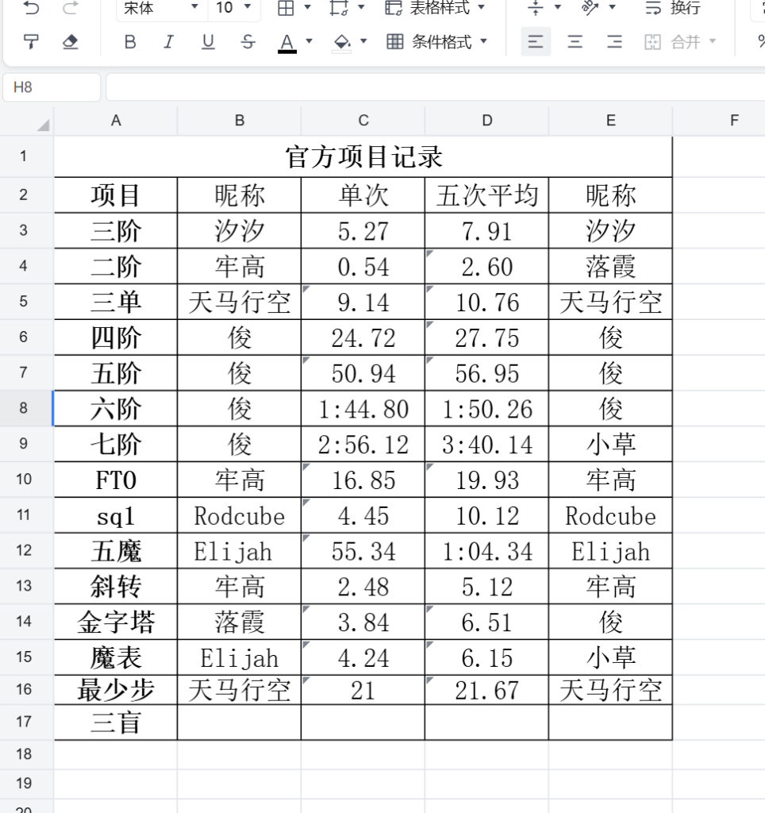
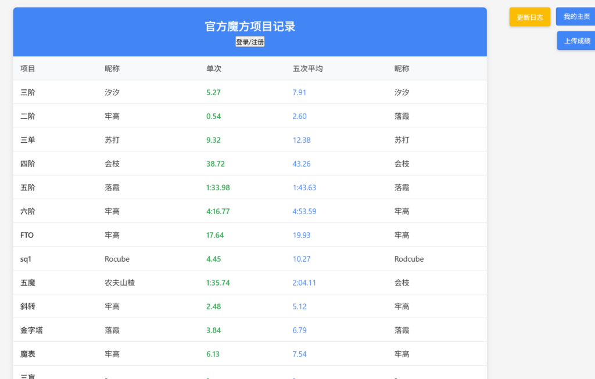
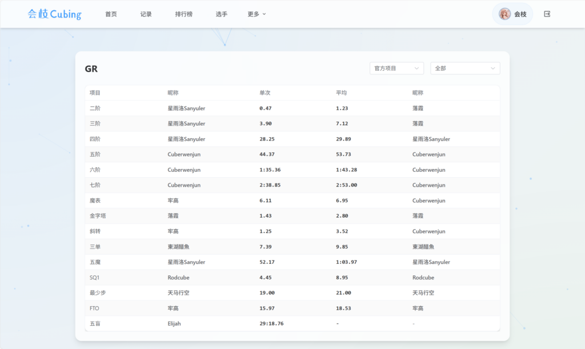

## 引言

如果是以前的我，应该不会考虑什么“年度总结”。

对我而言，大多所谓的“节日”，包括元旦在内，和正常的日子都无二样，更不会谈相应的举措。
前段时间“冬至”，大家都在吃饺子，恰巧那段时间饺子是我每天都要当午饭吃一顿的（）

我是很乐于写点什么碎碎念的东西，年度总结当然也可以是。
通常，个人的“年度总结”往往形式单一，“九宫格”+“小作文”，毫无疑问是信息过载的（朋友圈/动态 的空间实在有限），正巧近期拥有了一个属于自己的博客网站，便想着借此机会写一篇“年度总结”式的碎碎念了。

正文如下：

# Summary

简单分了三板块：

### “捣鼓” on 计算机+

**引言**

我个人是比较喜欢捣鼓和计算机相关的东西的，从我拿到第一台笔记本电脑开始（虽然最开始以美化，妙妙小工具为主），2025这一年开始接触一些更深入的东西，例如建立一个完整的网站，搭建一个丰富功能的bot...

这一年也是 **AI 急速发展**的一年，从年初的 ds 兴起，到后来的以 ai agent 为基础的 vibe coding，再到现在各个顶尖模型在各个领域上能力的不断突破，很快，真的很快。作为一个学生也常常感受到 AI 的便利，我从最开始的不断 cv 写出简陋的 H5 页面，到后面使用 cursor 的 ai agent 来 vibe 出一些更加完整、精美、具有框架的网站，再到现在使用 gemini 3 pro ，在它的指导下，扩展了很多知识面和技能，逐渐走向“数字游民”，我早已不把它当做工具来使用，更像是我的知心朋友。

记得当初选专业时，也不知道所谓的“计算机专业”意味着什么，只知道很热门很赚钱，听着也很高级，此前相关的接触大概只有小学的微机课以及高中的汇考（忘了哪个hui）了。然后第一志愿报了西电的计算机，但是被同济截胡（高校专项优先），无奈去了机械。后来会有转专业的想法吗？当然有过，不过随着认知的完善，也意识到另一条道路未必充满鲜花，计算机所学的很多也并非是我感兴趣的内容，如果只是作为一个业余的，偶尔“捣鼓”的爱好的话，可能反而是个更好的选择。

### 历程

**开始**：大一寒假的时候忘了因为什么开始对网站感兴趣，在菜鸟教程上每天看看三件套的教程，不过也没学多深，只会最最基础的语法结构。

中间参加了一个“计算机设计大赛”，和队友用 ds cv了一个简陋的纯静态网站，唯一的 api 调用是调的 ds 来分析 ，然后混了个时候市二等奖，可见这个比赛还是比较水的。

后来大概在五六月份的时候，自己的魔方小群里，大家正兴致勃勃的讨论“群记录（GR）”这个概念，然后从腾讯文档表格的一个个填写，到我尝试使用 vsc 写一个纯静态的表格网站，再到我下载 cursor 开始 vibe coding ，那段时间每天都在和 ai 斗智斗勇，还不会用 git ，只是用了 sealos 的云开发，很鸡肋，也是走了很多弯路。到后面的不断修 bug 优化，并且接入 q群 bot 来实现群聊和网站的互通，但是水平有限，所以后面成了史山也很少维护了，打算后面有空重构一版。

 三个阶段的截图

现在的网址：[会枝 Cubing](https://hzcubing.fun)

### 发展

在尝到了 Vibe coding 的即时反馈感这个“甜头”之后，我就开始经常写一点小工具小网站了，例如自己用的连点器，魔8方社周赛网站什么的。这个时期在掌握了 git 之后，就开始用 github 了，搞了杂七杂八的东西，其实没什么好说的。

### 现在

也就最近一个月左右吧，开始扩展其他方面的，不再局限于写点小网站。

学的也很杂，服务器倒是捣鼓了不少，从各大厂商白嫖的机子，加上自己搭建 Astrbot 买的 vps ，也有个五六台了，短的一个月，长则一年（serv00的十年虚拟主机不算），纯命令行式的交互系统给我一种独特的感觉，虽然总是边问边敲命令，中间还顺便把我的旧手机和平板都装上了 Linux（Debian），其中一台跑了个 bot。然后关于网络的基础知识，以及一些常见的运维工具也有了了解。其实后面有打算本地装一台 Linux 主机来玩（要不是现在基本没钱）。

我的博客，也即本站也是部署在 AWS 上的一台 EC2 ，wp的部署还是吃一点性能的，特地改成 2h2g 的，不然容易像我那台 1h1g 的 vps 一样经常崩。

我的 Astrbot 是上个月底买 vps 部署的，中间想给加上 wca 查询的时候，去插件市场搜居然没搜到，于是我自己 vibe 了一个，经历了几版改进，现在也是达到和 WCA 官网同步的查询了，而不依赖于服务器本地的数据库查询（因为直接用的 WCA源码里的 api）。在我提交第一版的 [WCA 查询插件](https://github.com/huizhiLLL/astrbot_plugin_wca) 时，没想到在 [Issue](https://github.com/AstrBotDevs/AstrBot/issues/4031#event-21547740348) 里遇到了魔友，同时收获了我的第一颗 star ，开心了很久 hhh。

中间还有个比较有意思的作品，也就两个星期之前的事，我偶然产生一个想法，即使用智能魔方来对 Web 中的行为进行控制，也就是魔方当做游戏手柄的意思。最开始是看 cstimer 源码，因为它对大部分的智能魔方都支持蓝牙连接，然后卡在数据包解密那一步，一直无法成功。
接着我找到个连 Gan 魔方蓝牙的库以及示例 Demo，想到直接基于这个把数据处理好的 Demo 进行开发，于是很快就成功了，我魔改了原 Demo 的 ui，删了很多东西，然后用 iframe 来嵌入游戏的窗口，就实现了用智能魔方控制游戏，网址：[Gan-Cube-Gams](https://smartcube.huizhi.pro) 详情可以看我的这期视频：[当智能魔方遇到2048？](https://www.bilibili.com/video/BV1Xtm2BiEPv/?spm_id_from=333.1387.homepage.video_card.click&vd_source=d87ba6642b76ba04624343b54caef166)（u1s1流量还可以，github上也有 3 个 star了）
目前是只有 2048 和 俄罗斯方块，其他的游戏要么我觉得太简陋，要么找不到开源的 Web 版本，要么在嵌入的过程中控制出现了难以修复的问题，不过也无大碍，这个概念已经实现了，进一步的想法就行扩展为系统级的应用，让魔方的转动操作不仅映射在浏览器，也映射在系统中。

关于这个，我在昨天(12.28)又产生了对应的作品想法，即另一端采用 MC 中的 Create 版魔方来表现（[【机械动力】复原机械动力三阶魔方_我的世界](https://www.bilibili.com/video/BV1c83zzxEyL/?spm_id_from=333.788.top_right_bar_window_default_collection.content.click&vd_source=d87ba6642b76ba04624343b54caef166)），先让魔方的转动映射到键盘的操作，然后键盘的操作再经过机械动力表现为 MC 中的魔方转动，虽然没什么实用价值，但我感觉还是挺有意思的。

当然，没有 Gemini 的帮助，我是做不到这些的。

### 魔方：练习与比赛+

**引言**

2025 这一年，或许会成为我参加魔方比赛最多的一年。

- 1.21 江苏扬州 新年赛

- 2.8-2.9 四川成都 WCA

- 5.1 上海 青少年大赛

- 5.4 安徽芜湖 中匈赛

- 5.25 浙江丽水 WCA

- 5.31 上海 高校赛

- 6.7 江苏盐城 WCA

- 10.8 上海 秋季公开赛

- 10.25 安徽合肥 WCA

- 11.23 上海 交大公开赛

- 11.29 浙江杭州 WCA（仅裁判）

不是因为真的跑了很多很多比赛，而是这一年的跨度，刚好经历了我入圈，再到淡圈的这一整个过程。

### 展开

我从寒假那会开始跑第一场外地的比赛，然后中期开始高强度练习并跑外地比赛，再到这两个月几乎无练习，只有平时的偶尔搓两把，也没什么兴致跑比赛了（虽然说米和时间也是因素），跑一场比赛的性价比在我心中已经降了一些了，真的蛮花钱的，如果没练一个成绩没刷的话更亏，当然如果一起去的朋友多的话可以魔聚也很爽。

我这一年的练习量，其实说多不多，说少也不少：

- 三速：17000 把左右 提升约 3 s 现百次 10

- 三单：10000 把左右 提升约 5 s 现百次 15

- 四速：5000 把左右 现百次 42

有记录的大概就这么多，除了三单进步稍微明显，其他都进步很慢，中间遇到了很长时间的瓶颈期，尤其是四阶。

### 魔方社

学校的魔方社主要在下半年开学后的那段时间突然活了起来，表现在新进来了数个水平在 10s 15s附近的同学并且进行了魔聚，不过后来也就没怎么看到他们的身影，倒也正常，平时社群聊的内容，非熟人不太好融入，我刚入学那会也是，直到下半年也才和其他人认识。

突然忘了社团的 b站 号还在我手上，自从第一次魔聚更新完就完全忘管了说是（）

其实原先红蓝魔方的目的还是挺好的，一直在呼吁号召我们高校活跃起来去参加他们的活动，但是因为一些误会和矛盾，后面就无往来了（摊手）

### 学业-->思考-->道路选择+

**大一上**上完时，我看着我 4.2+ 的绩点，还在幻想如果能这样保持下去的话，大概率是能保本校研的（不进智造）。后来**第二学期**，就“老油条”了，平时学的更少，开始搞期末冲刺了，最后绩点的严重下滑也在我的预料之中。

等到**大二上**，我开始自主的去走向，而非被迫，期末冲刺不挂科 这个保底的目标，因为这个时候的我已经没有打算保研的想法和决心了。保研所需要付出的时间和精力，也是可想而知的，我会因此放弃掉许多东西。所以我最后的结论是：不值得。

但真正当我去为未来的道路该如何走而思考时，已经是**12月中旬**了，其实也就差不多两个星期之前。

因为彼时我也在捣鼓 Web ，有着简单的“软硬结合”的想法，在与 Gemini 彻夜探讨时，我便初步确定了自己的道路，就是等大三开始找实习，然后就业。没有读研的义务！

虽然在学校的基础性课程我大概率是不怎么学，掌握度低，但用学这些课程的时间所能换来的价值，远远超过其自身。尽管我的认知尚短浅，对很多事情的理解就只是想当然，但我会去放开尝试我理想的那条路。（走投无路啊库鲁西o(╥﹏╥)o）

## End

当然还有很多都没写，有些不太适合以博客的形式分享出来（有些也记不太清了╥﹏╥），期末周码一堆字也码累了，暂且写这么多吧。

如果是以后应该不会这样了，因为会开始把相当一部分的内容都以文章的形式在平时就写出来，这样总结的时候就不用再详细说很多东西了，总结的成分会提高。

所以整体看下来的话，我的废话真的很多，所以我说是碎碎念形式的“年度总结”。

