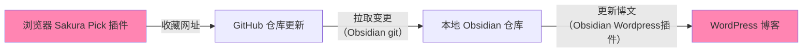

> **说明**
> 本文部分内容基于原博客框架 Wordpress 现已迁至本站（Astro）
> 故内容存在过时

## 一、引言

在开始之前，我想先阐明**收藏**和**导航**的区别。

随着网站浏览的增多，会发现对于网址的管理，实际上单单靠浏览器的收藏夹，又或是自建的[导航主页](https://nav.huizhi.pro) 都无法完全解决我的需求。

**收藏**，意味着较低的访问频率，而日常经常需要访问的网站，应当属于**导航**的范畴。

- **前者**（收藏）：需要易管理，容量大，并且写入频率高
- **后者**（导航）：需要便捷，容量取决于日常需求，写入频率较低（习惯的养成）

浏览器收藏夹当收藏了过多访问频率低的网站时，提供导航的能力便会下降；而导航主页若添加了过多的不常访问的网站，"导航"的主旨便会减弱。

所以就需要建立两套系统，一套用于日常导航，一套用于收藏管理。

前者我的部署方案可见[网页导航部署以及图床建立](https://blog.huizhi.ink/posts/web-navigation-and-image-hosting) 这一篇博文，此篇文章将主要介绍网站收藏的管理方案。

---

## 二、额外的需求

如果只是需要简单的管理一下收藏，直接使用浏览器的收藏夹即可。

但如果产生额外的需求的话，例如我希望将收藏的网址同时变为一个资源分享站（无需自己手搓），并且拥有更加美观的展示方式，就需要建立一套工作流。

### 实现方式



**工作流说明：**

1. **收藏阶段**：使用浏览器插件 [Sakura Pick](https://github.com/huizhiLLL/Sakura-Pick) 收藏网址，自动推送到 GitHub 仓库
2. **同步阶段**：通过 Obsidian Git 插件拉取 GitHub 仓库的变更到本地
3. **发布阶段**：使用 Obsidian WordPress 插件将收藏内容推送为博客文章

---

## 三、说明

**Sakura Pick** 是我简单开发的一个浏览器插件。

具体的安装方式见[仓库](https://github.com/huizhiLLL/Sakura-Pick) `README.md`，链接追加格式可以自行修改代码。我这里是按分类对文件进行区分，并单独作为一篇文章。

---

## 四、新的问题

由于分类很多，这些推送的网站管理文章会对首页、归档造成某种 **污染**。

（而这些分类的文章我统一链接到一个主导航页面进行展示）

### 解决方法

1. 将这些网站管理文章统一安排在一个特定的分类下，例如 **web-links**
2. 修改主题的模板代码（需要过滤的页面）以及 `functions.php`（对首页的非模版页进行过滤）

> 可以直接进入后台管理中的 **外观** - **主题文件编辑器** 中进行编辑

#### 修改 `functions.php`

在文件的末尾添加以下代码：

```php
// 在文件的末尾添加以下代码
function exclude_category_from_home( $query ) {
    // 判断条件：必须是主页(is_home) 且 是主查询(is_main_query) 且 不是在后台(!is_admin)
    if ( $query->is_home() && $query->is_main_query() && ! is_admin() ) {
        // 设置排除的分类ID，array后的括号中填你想要过滤的分类id
        // 分类id在 文章-分类目录 悬停某个分类时显示的链接中获取
        $query->set( 'category__not_in', array( 1,4,6 ) );
    }
}
// 将函数挂载到 pre_get_posts 钩子上
add_action( 'pre_get_posts', 'exclude_category_from_home' );
```

#### 修改 `page-archive.php`（以归档页面模版为例）

将：

```php
$the_query = new WP_Query( 'posts_per_page=-1&ignore_sticky_posts=1' );
```

替换为以下代码段：

```php
// 排除分类 ID 为 6 的文章
$args = array(
    'posts_per_page'      => -1,
    'ignore_sticky_posts' => 1,
    'category__not_in'    => array( 6 )
);
$the_query = new WP_Query( $args );
```

> **说明：**
>
> 也可按标签进行过滤，只需将代码片段中的 `category__not_in` 修改为 `tag__not_in` 即可。
>
> （实际上可以通过这种方式来对某些页面达到精准控制想要展示的文章类别的效果，例如我在首页还加入了 Life 分类的 id）

---

## 五、总结

这个方案将 **网站收藏** 这个信息流通过不同的插件，单向汇总为一处地方，便于管理和分享。

### 特点

1. **自动化流程**：从收藏到发布全程自动化，无需手动整理和复制粘贴
2. **集中管理**：所有收藏统一存储在 GitHub 仓库，便于备份和版本控制
3. **多端同步**：通过 Obsidian Git 插件实现本地和远程的实时同步
4. **自动发布**：一键推送到 WordPress 博客，自动生成资源分享页面
5. **分类清晰**：按分类组织收藏，避免首页和归档被"污染"

### 适用场景

- 需要长期保存大量网站资源
- 希望将私人收藏转化为公开资源分享站
- 使用 Obsidian 管理知识库并希望与博客联动
- 需要对收藏内容进行分类管理

