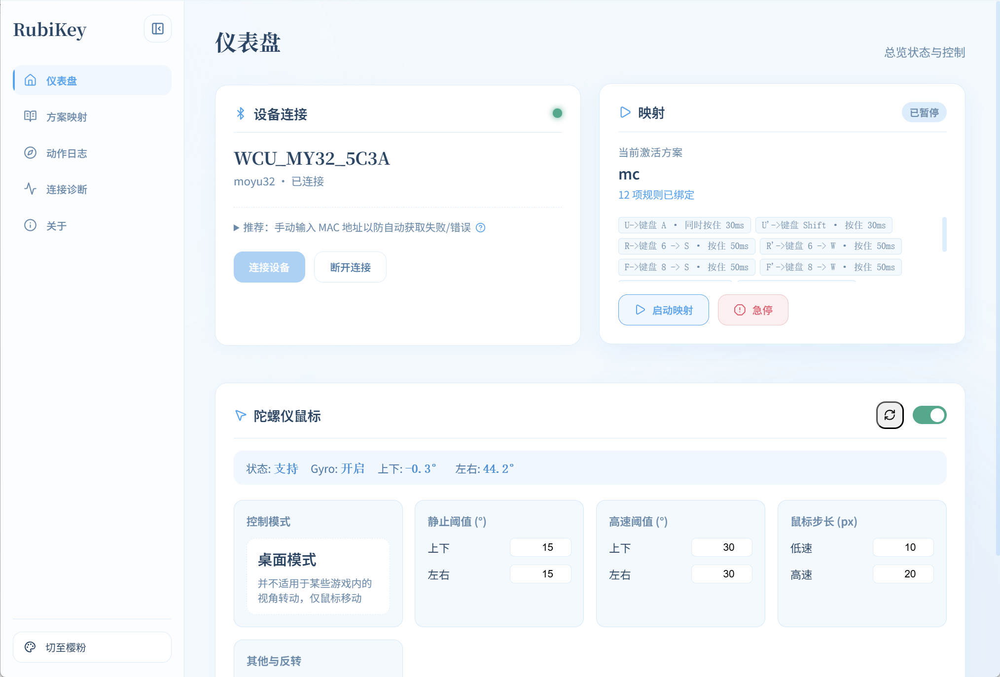

## 前言

> 此处为具体思路和原理讲解，想要快速上手可直接跳至**环境准备**开始。

从视频展示的效果来看，智能魔方的转动和 MC 中的魔方状态达成了某种同步。那么在不修改游戏代码、不添加额外 mod 的情况下，该如何做到？

### 机械动力三阶魔方的操作方式

在此之前，需要先了解一下在 MC 中用到的机械动力三阶魔方的操作方法——通过快捷栏中绑定了不同**无线红石信号终端**的**无线红石遥控器**来对不同的面进行正/反转动。

在操作过程中，只需要快捷栏的切换以及 `W`/`A`/`S`/`D`/`Shift`/`Space` 的组合（快捷栏切换不会打断操控状态），就可以梳理出一套按键与 12 个转动的一一对应关系。

例如：

| 转动记号 |       按键组合        |     |
| :--: | :---------------: | --- |
|  U   | `Shift` + `Space` |     |
|  U'  |      `Space`      |     |
|  D   |        `A`        |     |
|  D'  |        `D`        |     |
|  F   |     `8` + `S`     |     |
|  F'  |     `8` + `W`     |     |
|  R   |     `6` + `S`     |     |
|  R'  |     `6` + `W`     |     |
|  L   |     `7` + `W`     |     |
|  L'  |     `7` + `S`     |     |
|  B   |     `4` + `S`     |     |
|  B'  |     `4` + `W`     |     |

> 仅示例，方案不唯一。实际的无线红石信号终端控制中，以转动记号的视角来看有一些是重复的。

### 映射层：RubiKey

到了这里，在内容连接上要做的工作就很清晰了——做一个**智能魔方转动信号**与**键盘输入**之间的映射层。

参考了 cstimer 等项目后，我把这个映射层封装为了一个桌面工具「**RubiKey**」。

工具已开源，欢迎点个 Star 支持一下喵～

> [huizhiLLL/RubiKey：基于 Electron 和 React 的整活项目，让智能魔方触发 Windows 系统的键鼠行为](https://github.com/huizhiLLL/RubiKey)

最后，打通连接映射层，游戏中按下 `F1`，就能达到所谓的「同步」感啦～

---

## 环境准备

**硬件与系统：**
- 一颗智能魔方（GAN / 魔域）
- 一台 Windows 11 笔记本/电脑
- 一点点耐心
（Windows 10 理论可行 不保证稳定）

**需要额外下载的：**
- [机械动力三阶魔方存档](https://openlist.huizhi.ink/d/OneDrive/ZIP/3%C3%973%C3%973%20Rubik's%20Cube.7z)（来源：b 站大佬 cym_STUDIO）
- RubiKey（智能魔方映射层）：
    - [RubiKey | Github Releases](https://github.com/huizhiLLL/RubiKey/releases/latest)
    - [RubiKey | huizhi's OpenList](https://openlist.huizhi.ink/OneDrive/Software/RubiKey) （网络环境不佳时选择）
    注意：仅体验推荐下载 `portable` 版本 双击即可打开使用
	方便更新可下载 `Setup` 版 安装后使用

> RubiKey 是笔者简单搓的一个小工具，有能力的读者也可以参考 cstimer 源码自行开发映射层。

---

## 开始

**1. 进入存档**

- 启动 Minecraft
- 进入机械动力存档
- 确保快捷栏中的无线红石遥控器数量完整，以及魔方状态正常

**2. 连接智能魔方**

- 打开 RubiKey
- 填入要连接的智能魔方的 MAC 地址
- 点击「连接魔方」，选择对应设备，静待连接成功

**3. 启动映射**

此时魔方的转动将同步到对应方案的键鼠操作上。陀螺仪鼠标可以选择关闭，以防干扰。

**4. 回到游戏**

回到 Minecraft 中，先拿着一个无线红石遥控器右击进入操控状态，然后尝试转动魔方，观察 MC 中的魔方是否正常跟随转动。如果正常，按 `F1` 隐藏 UI，即可达到视频中的演示效果

> 可选：使用 `/tick rate xxx` 调整游戏随机刻的速率可加快 MC 中的魔方转动速度，建议设置为 40～80（默认为 20）。

>  注意：魔方切记不要转动太快，防止 MC 中的魔方发生转动碰撞导致异常。若发生异常，需要到地面按下按钮重置魔方状态。

---

## 结语

教程中会有许多未详细讲到的点，希望各位在遇到问题时首先尝试自行探索解决。若仍未解决，可在 GitHub 上提 issue/PR，或者 b 站评论/私信。

**至此教程结束** 

但这只是一个应用上的体现（Minecraft）——在拥有这样一个映射层的软件之后，你可以自由配置想要映射的内容，玩 2048、地铁跑酷、赛车游戏等键鼠复杂度不高的内容都变得轻而易举，不再受限于 app 生态或浏览器沙盒，你的智能魔方能操控什么，完全由你来定义～

