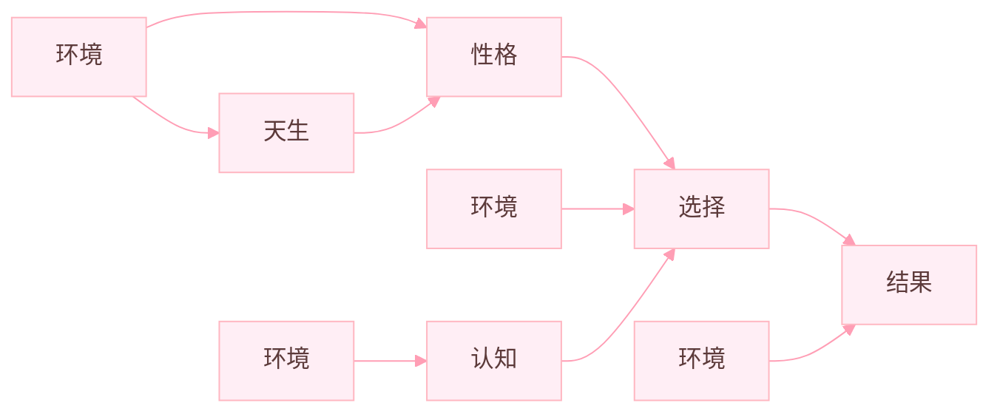
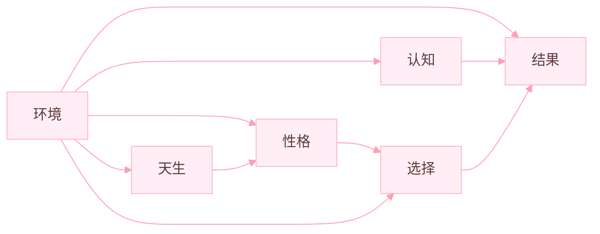

有关班内狗吠，阴阳的记录想必已经数不胜数，我不清楚他人是如何看待这个现象的，反正即便是知道这是正常必然发生的现象，我也打心底的会觉得很可笑。虽然难以忍受，我也不会，更不可能加入这个行列。这种行为与我内心的观念相背，加入只会让自己更加厌恶自己。

至于为何，，我想应该是我早年的生活环境所致，因为我并非土生土长的固始人，从我出生直至五年级毕业，我都在上海生活。那里确是实行了真正的素质教育，在潜移默化之中，我的改变使我在六年级回乡后难以适应这个环境，直至现在也是。我改变不了环境，又不得不坚守内心，因而只能告诉自己再熬半年，然后走出去看看世界，被眼前这微不足道的烦心事，烦心人所阻挠固然不是明智之举。

龙哥也说过成人 > 成材，纵使班内的多数人成绩比我好，我也不会因此自卑，因为我能看到这成绩之外，有更重要的东西，我还没丢。只有目光长远一点，才能排解眼前的忧虑。是可谓“人无远虑，必有近忧”矣。

近来有观他人之周记，“若合一契”，不禁拾笔摘抄：
*中式教育与应试教育之下，我所面对的是什么呢？我看不惯你的封建，却又心疼你的操劳；我被你霸道而又沉重的爱包裹着，我同你讲道理，你说为我好，我同你讲感情，你说都为了我，你诉说你的辛劳，却只用来令我更沉重。观念无法改变，思想又难以统一。你令我又爱又恨，我知道，你是爱我的，但却以沉重的方式，我希望你好，希望你不再生气，不想看到你怒其不争的模样。*

我知道的当我得到一件事物的同时，也会失去一件事物。物亏与此而盈于彼。所以对于我所经受的，只是我的选择而已。暂时的安逸所带来的快乐无与伦比，长久的拼搏所赋予的充实亦无可替代。我以为可以游戏人生，无所在意，但是好像不那么正确。貌似每当此时我都有诸多选择，以往，我都是坚定不移地“改过自新”“痛定思痛”，但现在我出奇的平静，成长和生活总是顺势而为，顺天而行。忤逆天道貌似从无好的结果，玄学只是更高等的科学而已，中国古代学术大多为经验之学，确有参考价值，希望我以后能弄清我真正追求与渴望的。至于现在，好好活着便好。

再抄个图（诶嘿）：

我将其简化后如下：

**在我看来** 环境永远起主导因素，而所认为的“人的内因起决定性作用”，也只是环境的一种表现形式，不过这样说确有牵强，倒不如说，环境是引发改变的根源，而产生的改变又反过来作用于环境，似乎是一种正反馈的关系。而在这个过程中，产生了这个世界以及你我我人生，人的本身不也正是环境作用的结果吗。

表面永远是表面，深入了解后才能理解品味名为“乐趣”的东西。啊，我不过是想说人的思想（考）远比其表面的行为有趣的多呢！