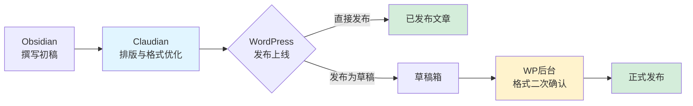

## did
1.  买了一台新的rn-vps 2h2.5g 130拿下 美滋滋
2.  逐渐确定博客的发布工作流：

```mermaid
graph LR
    A[Obsidian<br/>撰写初稿] --> B[Claudian<br/>排版与格式优化]
    B --> C{WordPress<br/>发布上线}
    C -->|直接发布| D[已发布文章]
    C -->|发布为草稿| E[草稿箱]
    E --> F[WP后台<br/>格式二次确认]
    F --> G[正式发布]

    style B fill:#e1f5ff
    style F fill:#fff3cd
    style D fill:#d4edda
    style G fill:#d4edda
```

**工作流说明:**
- **蓝色节点 (Claudian)**: 需要注意 WordPress 文章格式兼容性
- **黄色节点 (WP后台)**: 需要人工二次确认格式
- **绿色节点 (已发布/正式发布)**: 流程完成