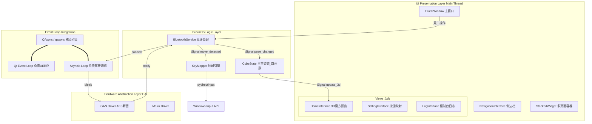

### 表现层
PyQt6 + PyQt-Fluent-Widgets

RubiKey/
├── app/
│   ├── common/              # 通用工具 (Config, SignalBus)
│   │   ├── config.py        # 基于 qfluentwidgets.Config 的配置管理
│   │   └── signal_bus.py    # 全局信号总线
│   ├── components/          # 自定义 UI 组件 (3D View)
│   │   └── cube_gl_view.py  # OpenGL 魔方渲染控件
│   ├── resource/            # 图片、图标、QSS样式
│   ├── view/                # 具体的页面界面
│   │   ├── home_interface.py
│   │   └── setting_interface.py
│   └── main_window.py       # 主窗口组装
├── core/                    # 核心业务 (无 UI)
│   ├── bluetooth_service.py # 封装 Bleak，发射 Qt 信号
│   └── key_mapper.py        # 映射逻辑
├── firmware/                # 硬件协议 (从原项目重构)
│   ├── gan_cube.py
│   └── aes_crypto.py
├── main.py                  # 启动入口 (配置 qasync)
└── requirements.txt