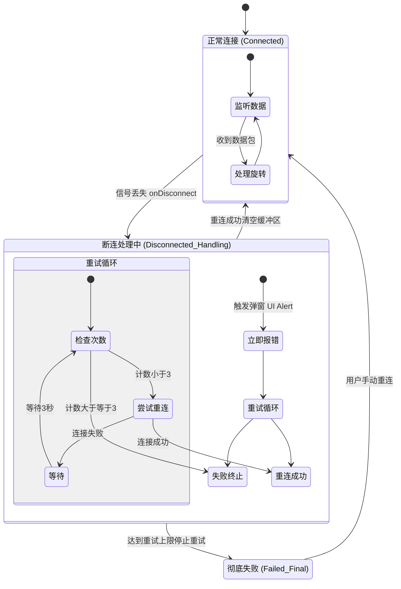

### 断连的错误处理流程

```mermaid
stateDiagram-v2
    %% 状态定义
    state "正常连接 (Connected)" as Connected
    state "断连处理中 (Disconnected_Handling)" as Handling
    state "彻底失败 (Failed_Final)" as Failed

    %% 初始状态
    [*] --> Connected

    %% 正常运行状态
    state Connected {
        [*] --> 监听数据
        监听数据 --> 处理旋转: 收到数据包
        处理旋转 --> 监听数据
    }

    %% 触发断连
    Connected --> Handling: 信号丢失 onDisconnect

    %% 断连处理逻辑
    state Handling {
        [*] --> 立即报错: 触发弹窗 UI Alert
        立即报错 --> 重试循环

        state "重试循环" as Loop {
            [*] --> 检查次数

            检查次数 --> 尝试重连: 计数小于3
            尝试重连 --> 等待: 连接失败
            等待 --> 检查次数: 等待3秒

            检查次数 --> 失败终止: 计数大于等于3
            尝试重连 --> 重连成功: 连接成功
        }

        重试循环 --> 重连成功
        重试循环 --> 失败终止
    }

    %% 最终出口
    Handling --> Connected: 重连成功清空缓冲区
    Handling --> Failed: 达到重试上限停止重试

    %% 彻底失败后的手动恢复
    Failed --> Connected: 用户手动重连
```

