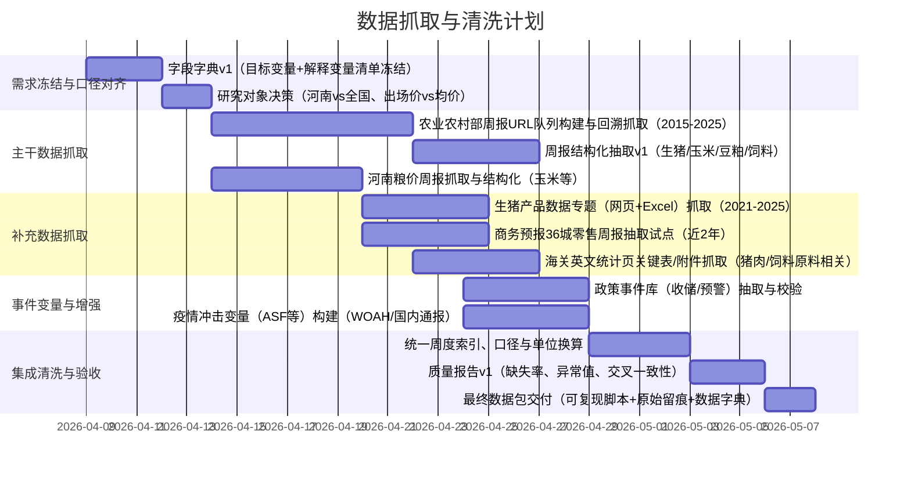

# 统计建模大赛生猪价格预警选题的数据源与抓取清洗深度调研报告

## 执行摘要

本报告围绕你当前统计建模大赛作品（初稿与框架已给出研究对象、建模思路和若干数据源线索）进行“数据侧”深度调研：核对既有 `data_source.md` 中的数据源与字段需求，并在此基础上补齐数据源、明确可抓取目标、提出数据增强与质量验证方案，最终给出可执行的抓取与清洗时间表与对外取数建议。你提供的初稿与框架将研究对象聚焦为**河南省生猪出场价（周度，2015–2025）**，方法上使用**贝叶斯结构时间序列（BSTS）**并结合门限/预警机制来实现价格波动预警与调控策略研究。fileciteturn0file2 fileciteturn0file3

结论上，当前最关键的“缺口”仍是：**2015–2025 年河南省（省级口径）周度生猪出场价的公开、可复现、可批量抓取数据源不足**。你在 `data_source.md` 已明确指出该缺口并因此暂以全国或低频替代源支撑。fileciteturn0file1 本报告进一步确认：农业农村部“畜产品和饲料集贸市场价格情况”周报可稳定追溯到至少 2015 年（周度、全国口径，含生猪/仔猪/猪肉/玉米/豆粕/配合饲料等），适合作为**主时间序列骨架**；而农业农村部“生猪产品数据专题”提供自 2021 年起的“生猪出场价、二元母猪、仔猪、屠宰量、进口量”等结构化表格与 Excel 下载，适合作为**高可信校验与特征补充**。citeturn17search0turn30search2turn7view0

为解决“河南周度出场价”缺口，本报告提出三条可落地路径（从稳妥到激进）：  
1) **研究对象微调路径**：将“河南省周度出场价”调整为**全国周度生猪均价/出场价**（2015–2025 可完整抓取），同时保留河南作为政策与产业分析章节的案例省份（利用省级年鉴/公报与政策文本做结构性论证）。citeturn17search0turn30search2turn25search3  
2) **省级数据补齐路径**：以**河南省粮食价格周报（玉米等）**做成本端省级锚点（已存在结构化表格、可周度抓取），同时对河南生猪价格采用“官方联系 + 半官方补充”组合：优先联系河南发改价格监测条线获取历史周度数据；若无法获得，再引入行业数据（如第三方行情）并用农业农村部全国周度序列做一致性约束与偏差校准。citeturn15search13turn14search14turn15search12  
3) **模型输入替代路径**：维持河南研究对象，但将“出场价周度”替换为**更可获得、且与出场价高度相关的同频指标**（例如：全国周度生猪均价 + 河南玉米周价 + 36 城猪肉零售周价 + 主要政策事件哑变量），并在论文中透明说明口径差异与稳健性检验。citeturn30search2turn31search11turn18search5

大赛通知强调“服务国家战略、创新统计赋能”等导向，你的“猪周期预警与调控策略”方向与政策语境高度契合；因此数据侧的关键在于**口径清晰、可复现抓取链路、以及对政策预警机制的可映射性**。fileciteturn0file0 citeturn18search1turn15search12

## 现有材料核对与研究对象决策

### 大赛主题与作品框架对数据的硬约束

你提供的初稿和框架把“核心研究对象”写为：**河南省生猪出场价周度序列（2015–2025）**，并计划用 BSTS 进行分解、解释与预测，同时结合“猪粮比”等阈值式预警机制给出调控建议。fileciteturn0file2 fileciteturn0file3 这意味着数据侧至少需要满足四类硬约束：

第一，**时间频率一致性**：主建模序列为周度，解释变量最好周度；若是月度/季度，需要有明确的对齐策略（插值、保持阶梯、或在状态空间模型中处理异频）。  
第二，**口径一致性或可校准性**：出场价/收购价/批发价/零售价的经济含义不同；若混用，必须提供对齐与稳健性策略。农业农村部周报使用全国集贸市场监测与“全国生猪平均价格”等口径，且明确为“全国500个县集贸市场和采集点”的周度监测框架。citeturn30search2turn17search0  
第三，**政策机制映射**：如果论文要对接“猪粮比预警—收储/投放”一类政策动作，则至少要能构造猪粮比（生猪价格/玉米价格）并标注关键政策节点。猪粮比的政策含义与阈值机制在政府与主管部门传播材料中有较清晰表述。citeturn15search12turn18search1  
第四，**可复现抓取链路**：大赛评审往往重视数据处理过程透明与可复查。你作为代码手，需要能提供脚本化抓取、原始留痕与清洗日志。

### 对你提供的 MD 文件的核对结果

你提供的 `data_source.md` 已完成“初步排查”，并给出“数据源状态总表”，覆盖 13 类来源（农业农村部生猪产品数据专题、农业农村部周报栏目、河南省发改委价格监测文章、河南/郑州粮食系统周报、统计公报/年鉴、发改委相关页面、以及部分商业行情站点等），同时对“是否可导出/颗粒度/建议定位/留痕策略”给出了可执行建议。fileciteturn0file1

核对要点与结论如下（按“字段需求是否被满足”来归纳，而不是简单复述来源清单）：

其一，你在 MD 中把“河南生猪专题（Mysteel）”“搜猪网”等判定为“更多是当期行情或短期走势图，难以稳定获得长历史周度数据”，因此不作为主抓源；这一判断与实际公开页面形态相符（多为“今日价/快讯/图形化走势”，历史深度受限且导出不稳定）。fileciteturn0file1 citeturn16search7turn16search6  

其二，你将农业农村部“生猪产品数据专题”定位为高可信补充源，并指出其数据**起点更靠后（你当时确认约 2021 年起）**；最新页面也显示该专题提供结构化表格并支持“表格下载”，且确有年份选择（至少含 2021–2026）。fileciteturn0file1 citeturn7view0  

其三，你将农业农村部“畜产品和饲料集贸市场价格情况”定位为最重要的周度来源之一，并提出“优先抓生猪/玉米/豆粕/仔猪等字段”；经外部核验，该周报在 2015 年已有连续发布记录，且最新年份仍沿用“全国500个县集贸市场和采集点”的周度监测口径，字段覆盖与论文需求高度契合。fileciteturn0file1 citeturn17search0turn30search2  

其四，你对河南省粮食和物资储备系统的周报源在 MD 中已有关注；本次外部检索进一步确认“全省主要粮食品种价格周报”确实以表格形式发布，包含河南省与地市的玉米“原粮收购均价/环比”等字段，能成为你构造“成本端/猪粮比”的省内锚点数据。citeturn15search13turn15search14  

其五，MD 中最核心的“缺口”与本报告一致：**河南省层面的高频生猪出场价**公开可批量抓取源仍不理想；因此你需要在“研究对象是否必须河南 + 是否必须周度出场价”之间做一个“数据可获得性—论文叙事完整性”的最优权衡。fileciteturn0file1  

### 建议的研究对象决策框架

为了让后续抓取与清洗不在中途“推倒重来”，建议你用下面的三问框架快速定稿研究对象（每问对应一套数据落地方案）：

第一问：目标变量是否必须是“河南省”？如果“必须”，则应同步启动对外取数（联系河南发改价格监测条线/价格监测局）作为主路径，并将公开周报作为替代与校验；如果“不必须”，则全国周度序列可极大降低数据风险。citeturn14search14turn30search2  

第二问：目标变量是否必须是“出场价”（而非“生猪均价/收购价/批发价/零售价”）？如果“必须”，则更接近国家发改委价格监测体系口径；如果“可替代”，农业农村部周报（全国生猪平均价格）与商务预报（猪肉零售）可以组合成“产业链价格传导”叙事。citeturn14search14turn30search2turn31search11  

第三问：是否必须“周度”？如果“必须”，优先以“农业农村部周报 + 省内粮食周报 + 政策事件周度对齐”构造周度面板；如果“可放宽”，则农业农村部生猪专题（月度）能显著增加指标维度（屠宰量、进口、母猪价格等）并降低噪声。citeturn7view0turn30search2  

## 数据源清单与字段覆盖评估

### 字段需求口径与“覆盖度”定义

结合你的初稿/框架与 MD 文件中“优先字段”描述，本报告将字段需求归为 6 组，并以“覆盖度”做简化标注：  
- **核心Y（必须）**：生猪出场价/生猪均价（周度）。  
- **成本端（强建议）**：玉米价格、豆粕价格、育肥猪配合饲料价格（周度优先）。  
- **供给端（强建议）**：能繁母猪、仔猪价格、屠宰量/出栏/存栏（允许月度/季度）。  
- **需求端（建议）**：猪肉批发/零售价格、CPI 猪肉分项（允许月度）。  
- **外生事件（建议）**：收储/投放政策节点、疫情事件（可周度事件变量）。  
- **宏观控制（可选）**：节假日、天气、经济景气（可周度/日度后聚合）。

“字段覆盖度”标注规则：**全**=可直接获得核心字段并与频率对齐；**部分**=字段齐但频率/口径需处理；**弱**=字段缺失或只能文本抽取。

### 至少二十个可用数据源总表

下表按“优先中文/官方/原始数据”的要求，把可用数据源分为“主干数据、官方补充、外生事件、市场与替代、国际与学术/开源”五类混排展示（你后续可按优先级筛选）。其中“可抓取性/清洗难度”均为**面向脚本化抓取与可复现清洗**的工程评估。

| 数据源名称 | 提供机构/网站 | 数据类型与时间范围 | 关键字段与字段覆盖度 | 获取方式 | 许可/使用限制 | 更新频率 | 可替代源 | 可抓取性 | 清洗难度 | 主要清洗问题 |
|---|---|---|---|---|---|---|---|---|---|---|
| 畜产品和饲料集贸市场价格情况（周报） | entity["organization","农业农村部","china ministry of agriculture"]（畜牧兽医局） | 周度；至少覆盖 2015 至今 | 生猪/仔猪/猪肉/玉米/豆粕/多类配合饲料等；覆盖度：**全（全国口径）** | HTML 抓取（表格/段落）；可批量遍历归档页 | 官网一般性版权声明；需保留引用与来源说明 | 周 | 省级发改委猪粮比周报（若可得）；行业行情站点 | 高 | 中 | 早期页面表格不统一、字段名称变化；单位与小数位不一致；缺失周/节假日周对齐 |
| 生猪产品数据专题（结构化表+Excel） | 农业农村部（专题站） | 月度/阶段性；至少 2021–至今 | 生猪出场价、二元母猪、仔猪、屠宰量、进口量等；覆盖度：**部分（频率较低但指标丰富）** | HTML 表格抓取 + Excel 下载 | 专题页可下载表格；仍需遵守官网转载/引用规范 | 月/不定期 | 农业农村部相关月报；统计公报/年鉴 | 高 | 低-中 | 指标定义口径变化（如屠宰统计口径变动）；字段中文括注需解析；日期粒度为“月” |
| 生猪产品数据专题（PDF版月报/资料） | 农业农村部（PDF发布） | 月度；2021–至今（逐期 PDF） | 同上；覆盖度：**部分** | 下载 PDF 后解析表格（建议优先 Excel，PDF作校验） | 同官网转载规范 | 月/不定期 | Excel 版；网页表格版 | 中 | 中-高 | PDF 表格抽取不稳定、合并单元格、页眉页脚噪声 |
| 全国重要消费品和服务价格监测报告制度（方法与品类） | entity["organization","国家发展改革委","china ndrc"] 价格监测渠道（制度文） | 制度性文件；给出周报项目与采集点/频次 | 给出周报项目、采集日、报送要求；覆盖度：**弱（不是数据）** | 下载/保存 PDF/网页 | 政务公开文件，引用需标注来源 | 修订不频繁 | 部门解读材料 | 高 | 低 | 作为“口径定义与方法论”引用，不做数值抽取 |
| 猪粮比价预警相关公开信息（公告/新闻） | 国家发改委/中国政府网等 | 事件序列；2015–至今（不连续） | 周度猪粮比、预警等级、收储启动等；覆盖度：**部分（事件变量）** | HTML 抓取 + 关键词抽取 | 政务公开转载规则 | 不定期 | 央视/新华社转载 | 中 | 中 | 事件不连续、需NLP抽取数值与区间、发布时间≠采集周 |
| 河南省粮食品种价格周报（含玉米） | entity["organization","河南省粮食和物资储备局","henan grain bureau, china"] | 周度；至少 2025 可见，通常可滚动多年 | 玉米/小麦等：价格区间、原粮收购均价、环比；覆盖度：**全（成本端省内锚点）** | HTML 表格抓取（read_html） | 政府网站转载规范 | 周 | 郑州粮食系统；全国玉米价格（周报） | 高 | 低 | 单位“元/吨”需换算；地市缺失不规则；发布日期与监测日期对齐 |
| 河南省发改委价格监测服务入口（在线查询/指数） | entity["organization","河南省发展和改革委员会","henan ndrc, china"] | 可能含高频价格与指数（需进一步验证可访问性） | 潜在：生猪、猪粮比、食品价格等；覆盖度：**未知（可能补缺口）** | 可能为 API/JS 接口；网站端存在反爬/403风控 | 政务服务类网站一般限制高频抓取 | 不定期/实时 | 线下/邮件申请历史数据 | 中-低 | 中-高 | 访问受限、动态接口、可能验证码；需要会话与请求签名分析 |
| 河南省农业农村厅政策与解读（猪粮比/收储等） | entity["organization","河南省农业农村厅","henan agriculture dept, china"] | 政策与解读文本；2015–至今 | 提供政策背景、猪粮比阈值解释等；覆盖度：**弱（事件解释）** | HTML 抓取（文本） | 政府网站转载规范 | 不定期 | 政府网/新华社 | 高 | 中 | 文本结构化：时间、阈值、政策动作需抽取；避免重复计数 |
| 农产品批发价格200指数日度公告（含猪肉批发价） | 农业农村部市场与信息化司 | 日度；至少 2017 上线后连续公告（以页面为准） | 200指数、“菜篮子”指数、猪肉批发价等；覆盖度：**部分（补需求端/批发端）** | HTML 抓取（固定段落+列表） | 官网转载规范 | 日 | 周报中的猪肉价格；商务部零售价周报 | 高 | 中 | 需从文本中抽取数值；字段列表可能扩缩；时间戳“截至14:00”需统一 |
| 商务预报：36城食用农产品零售价格（含猪肉后腿肉） | entity["organization","商务部","china mofcom"]（市场运行和消费促进司） | 周度；长期连续（以站内归档为准） | 猪肉零售、鸡蛋、油脂等；覆盖度：**部分（零售端）** | HTML/图像混排抓取（需验证页面结构） | 商务预报明确版权与转载要求；需保留来源与免责声明 | 周 | 农业农村部批发/周报；地方商务监测 | 中 | 中 | 页面可能为图片表格；需要OCR/图表解析；字段名有层级缩进 |
| 中国海关统计（英文站发布与月报） | entity["organization","海关总署","china gacc"]（英文站） | 月度/季度；长期 | 总进出口、按商品/国别汇总；覆盖度：**部分（外贸冲击/进口替代）** | HTML/PDF 下载 | 官网转载规范 | 月/季 | stats.customs.gov.cn 查询系统；UN Comtrade | 中 | 中 | 英文页面字段需映射；商品分类较粗；口径与农业专题进口量需对齐 |
| 海关统计数据在线查询平台（stats.customs.gov.cn 等） | 海关总署（在线查询系统） | 月度/自定义；平台自 2018 上线被多方引用 | 可按商品/贸易伙伴/省份等维度查询；覆盖度：**部分（可拉细分）** | 网页交互导出（可能验证码）；半自动 | 可能有导出上限与验证码；需遵守使用条款 | 不定期/实时 | 英文站月报；UN Comtrade | 低-中 | 高 | 验证码/会话；导出上限；字段编码映射与计量单位多样 |
| 国家数据（NBS National Data） | entity["organization","国家统计局","china statistics agency"]（data.stats.gov.cn） | 年度/季度/月度；覆盖至少 2015–2025 | 生猪存栏/出栏、猪肉产量、CPI（猪肉）等；覆盖度：**部分（频率多为月/年）** | 官方站点 + 隐式接口（easyquery） | 官网使用规范；高频调用需限速 | 月/季/年 | 统计年鉴/公报；农业专题 | 中-高 | 中 | 指标编码、地区代码映射；不同库（hgnd/fsnd等）结构差异；缺失值与修订 |
| 地方统计公报/统计年鉴（河南） | entity["state","河南省","henan province, china"]统计部门 | 年度；长期 | 生猪出栏/存栏、肉类产量、农业结构等；覆盖度：**部分（低频但权威）** | PDF/网页下载 | 引用规范 | 年 | 国家统计局省级年表 | 高 | 中 | 表格跨页、口径年度修订；OCR风险；需统一单位 |
| 全国饲料工业统计调查制度（制度与指标解释） | 农业农村部办公厅/国家统计局批准 | 制度性文件 | 说明饲料工业统计内容与频率；覆盖度：**弱（口径定义）** | PDF/网页下载 | 政务公开引用规范 | 修订不频繁 | NBS制度摘要页 | 高 | 低 | 作为“口径”引用，不直接产出时序 |
| 全国饲料工业统计调查制度主要内容（NBS说明页） | 国家统计局 | 制度摘要 | 调查内容含“主要饲料原料采购/库存/消费、产品市场价格”等；覆盖度：**弱** | HTML 抓取 | 引用规范 | 不定期 | 部委制度原文 | 高 | 低 | 仅作口径说明 |
| 省级“生猪及饲料价格监测周报”模板源（以四川为例） | 省级发改委价格监测 | 周度；连续多年 | 生猪收购/出场价、玉米、育肥猪饲料、猪粮比；覆盖度：**全（但地区非河南）** | HTML 抓取 | 地方政府网站转载规范 | 周 | 其他省份同类周报 | 高 | 低-中 | 指标名称高度稳定；可作为方法模板与“换省份”备选 |
| WOAH WAHIS 疫情数据（ASF等） | entity["organization","WOAH","world organisation for animal health"] | 2005–至今（按系统说明） | 疫情事件、地理信息、病例/死亡等；覆盖度：**部分（外生冲击）** | WAHIS 公共界面下载/报告抓取 | 官方说明：公共数据向公众开放用于分析决策 | 近实时/定期 | 国内疫情通报；学术整理集 | 中 | 中 | 地理层级不一、事件去重、中文地名映射；需要与周度对齐 |
| 国内非洲猪瘟应急实施方案与通报（事件节点） | 农业农村部/媒体转载 | 事件节点；2018–至今 | “首次暴发/预警/制度修订”等事件；覆盖度：**弱（事件变量）** | HTML 抓取 + 关键词抽取 | 引用规范 | 不定期 | WAHIS；省级通报 | 高 | 中 | 文本抽取日期、地点；避免与其他事件源重复 |
| 生猪期货/玉米期货行情数据（期货市场预期） | entity["organization","大连商品交易所","dce futures exchange, china"]相关行情页/聚合站 | 日度；生猪期货自上市后 | 合约结算价/成交量/持仓等；覆盖度：**部分（预期/风险溢价）** | HTML 抓取或第三方接口 | 行情站点可能限制抓取频率 | 日 | Wind/同花顺/新浪等 | 中 | 中 | 合约换月与主力连续合成；缺失交易日；节假日对齐 |
| 国家级生猪大数据中心（行业级日度监测） | 国家级平台（研究文献与新闻引用） | 日度；覆盖因平台而异 | 省际外三元价格、价差等（报道显示） | 可能需注册/授权；公开新闻可抓 | 平台可能有授权与商业限制 | 日 | 农业农村部周报；第三方行情 | 低-中 | 中-高 | 接口不公开、可用性不确定；若获授权需做字段与口径说明 |
| WAHIS 报告批量下载工具（开源实现参考） | entity["company","GitHub","code hosting platform"]开源仓库 | 工具与脚本 | 批量下载报告、结构化输出 | 直接使用脚本或借鉴实现 | 遵守开源许可证与WOAH使用条款 | 随项目 | 自研下载器 | 高 | 低 | 需要适配到你项目的数据字典与去重规则 |

表中“可抓取性/清洗难度”的含义：  
- **可抓取性高**：网页结构稳定、无需登录、无明显验证码/动态签名；  
- **可抓取性低**：需要登录、验证码、复杂动态接口或明显 403 风控；  
- **清洗难度高**：口径频繁变化、文本抽取为主、或需要复杂地理/时序校准。

## 可抓取目标与采集实现细节

本节给出至少 10 个可以“直接爬取或API调用”的目标（含 URL、接口说明、示例请求与返回字段），并对反爬策略与应对给出工程建议。为满足“URL必须给出”且不直接裸露链接的规范，所有 URL 均放在代码块中。

### 国家统计局 National Data 隐式接口（easyquery）

**用途**：获取省级/全国宏观与农业统计（猪肉产量、存栏/出栏、CPI猪肉分项等），作为中低频解释变量与稳健性检验。citeturn25search0turn25search3  

```text
目标URL（示例）：
https://data.stats.gov.cn/easyquery.htm?m=QueryData&dbcode=fsnd&rowcode=reg&colcode=sj&wds=[{"wdcode":"zb","valuecode":"A020101"}]&dfwds=[]&k1=1670574431409&h=1
```

接口说明：  
- `m=QueryData` 返回 JSON；  
- `dbcode` 选择库（如年度/季度/月度、全国/分地区等）；  
- `wds/dfwds` 控制维度与指标编码；  
- 返回 JSON 中常见节点包含 `returndata.datanodes`（数据点）与 `returndata.wdnodes`（维度字典），可据此构造 DataFrame。citeturn26view0  

示例请求（Python伪代码）：
```python
import requests, time
url = "https://data.stats.gov.cn/easyquery.htm"
params = {
    "m": "QueryData",
    "dbcode": "fsnd",
    "rowcode": "reg",
    "colcode": "sj",
    "wds": '[{"wdcode":"zb","valuecode":"A020101"}]',
    "dfwds": "[]",
    "k1": str(int(time.time()*1000)),
    "h": "1",
}
r = requests.get(url, params=params, headers={"User-Agent": "Mozilla/5.0"})
j = r.json()
nodes = j["returndata"]["datanodes"]   # 数值
dims  = j["returndata"]["wdnodes"]     # 维度字典
```

返回字段（关键）：`returndata.datanodes[*].data.data`、`returndata.datanodes[*].wds`、`returndata.wdnodes[*].nodes[*].code/cname`。citeturn26view0  

反爬与应对：可能对无 UA 或高频请求限流；建议  
- 单进程限速（例如 1–2 req/s），失败指数退避；  
- 缓存响应（本地落盘），避免重复请求同一指标；  
- 指标编码与地区编码用“字典表”持久化，避免每次全量拉取。citeturn25search6turn25search15  

### 农业农村部 畜产品和饲料集贸市场价格情况（周报页面）

**用途**：构建 2015–2025 周度主序列骨架（生猪、玉米、豆粕、饲料等）。citeturn17search0turn30search2  

```text
目标URL（示例，2015年周报）：
https://www.moa.gov.cn/gk/jcyj/xm/201501/t20150127_4353460.htm

目标URL（示例，2026年周报）：
https://xmsyj.moa.gov.cn/jcyj/202603/t20260325_6482639.htm
```

接口说明：无公开 API，直接抓 HTML。新版页面常含结构化段落与更稳定标题；旧版存在不同栏目路径（公开/日历/机构站），建议通过“站内搜索结果列表”或“按年目录 + 链接提取”构建 URL 队列。citeturn30search2turn17search0turn30search0  

示例抓取（Python伪代码）：
```python
import pandas as pd
import requests
from bs4 import BeautifulSoup

html = requests.get(url, headers={"User-Agent": "Mozilla/5.0"}).text
soup = BeautifulSoup(html, "lxml")
title = soup.find("h1").get_text(strip=True)
text  = soup.get_text("\n", strip=True)

# 若存在表格，可优先用 read_html
tables = pd.read_html(html)   # 可能为空或多个
```

返回字段（抽取后）：`week`（如“3月第3周”）、`采集日`、`全国生猪平均价格`、`玉米价格`、`豆粕价格`、`育肥猪配合饲料价格`等（以页面实际出现为准）。citeturn30search2turn30search3  

反爬与应对：一般无验证码；主要风险是历史页面结构差异与链接分散。建议  
- 先建“URL清单—原文HTML落盘—结构化抽取”三段式流水线；  
- 对早期“无表格仅文字”的页面，用正则/规则抽取并做单元测试（每年抽 3–5 篇做回归测试）。  

### 农业农村部 生猪产品数据专题（网页表格）

**用途**：获取月度结构化指标（出场价、母猪、仔猪、屠宰量、进口等），用于解释变量与校验。citeturn7view0  

```text
目标URL（示例，2026年2月数据页）：
https://www.moa.gov.cn/ztzl/szcpxx/jdsj/2026/202602/
```

接口说明：页面内包含结构化表格与指标解释（包含数据来源说明与部分口径调整提示）。例如页面明确“全国二元母猪销售价格”“生猪出场价格”等来自价格监测体系，且对屠宰量统计口径变动给出提示。citeturn7view0  

示例抓取：
```python
import pandas as pd, requests
html = requests.get(url, headers={"User-Agent":"Mozilla/5.0"}).text
tables = pd.read_html(html)
df = tables[0]  # 需根据实际表格索引选择
```

返回字段（抽取后）：`指标名称`、`本期值`、`环比/同比`（如有）、`单位`、`发布期（年月）`等。citeturn7view0  

反爬与应对：整体可抓取；建议把“指标解释段落”也落盘，因为后续论文写“口径说明/数据来源”需要引用。citeturn7view0  

### 农业农村部 生猪产品数据专题（Excel表格下载）

**用途**：优先用 Excel 替代 PDF/网页解析，降低清洗成本。citeturn7view0turn22view0  

```text
目标URL（示例，页面“表格下载”给出的xlsx）：
https://www.moa.gov.cn/ztzl/szcpxx/jdsj/2026/202602/202603/P020260320675663703590.xlsx
```

接口说明：直接 HTTP GET 下载 xlsx；字段通常与网页表一致。citeturn22view0  

示例：
```python
import pandas as pd
df = pd.read_excel("P020260320675663703590.xlsx")
```

反爬与应对：对附件下载可能有来源校验；建议加 `Referer` 为数据页、并保留下载失败重试与备用抓网页表格策略。

### 河南省粮食与物资储备局 粮价周报（HTML表格）

**用途**：省内玉米价格等（猪粮比、成本端冲击、地区异质性）。citeturn15search13turn15search14  

```text
目标URL（示例）：
https://lswz.henan.gov.cn/2025/06-26/3174444.html
```

接口说明：静态 HTML，表格字段包括“区域、品种、价格区间、原粮收购均价、环比”。citeturn15search13  

示例：
```python
import pandas as pd
tables = pd.read_html(url)
df = tables[0]
```

反爬与应对：通常无强反爬；注意按站点礼貌限速与缓存。

### 河南发改委 价格监测服务入口（可能为动态接口）

**用途**：若能打通，可能直接补齐“河南周度生猪出场价/猪粮比”历史。citeturn8view0  

```text
目标URL（入口页）：
https://fgw.henan.gov.cn/bmfw/jgjc/
```

接口说明：入口页可访问，但部分子功能页面出现 403（工具侧观测），推测存在更严格的访问控制或动态加载接口。citeturn8view0  

示例思路（伪代码）：用浏览器开发者工具抓取 XHR 接口（通常为 JSON），再用 requests 复现；必要时用 Selenium/Playwright 维持会话。  

反爬与应对建议：  
- 控制访问频率、模拟真实浏览器头；  
- 若存在验证码/登录，优先走**数据服务申请**路线（见“对外联系建议”），避免合规风险与工程不确定性。

### 农业农村部 农产品批发价格200指数日度公告

**用途**：补充“猪肉批发端”日数据，可聚合为周度用于需求端/价差特征。citeturn19search3turn19search13  

```text
目标URL（示例）：
https://scs.moa.gov.cn/jcyj/202602/t20260227_6481756.htm
```

接口说明：固定文本结构，包含指数数值与“截至14:00”若干品种价格列表（含猪肉、鸡蛋、白条鸡等）。citeturn19search3  

示例抽取（伪代码）：用正则提取“指数=数值”“猪肉平均价格=数值”。  

反爬与应对：页面量大（日度）；建议  
- 只抓你需要的字段，不全量存全文；  
- 按月分包抓取，避免一次性对站点造成压力。

### 商务部 商务预报：36城食用农产品零售价格（周报）

**用途**：零售端锚点（猪肉后腿肉零售价），可作为需求端或价差变量。citeturn31search11turn31search3  

```text
目标URL（示例）：
https://cif.mofcom.gov.cn/cif/html/nfcpdt/2025/6/1750994125902.html
```

接口说明：周度发布，页面可能含“图片表格 + 文字说明 + 免责声明”。版权条款在站内免责声明中明确要求保留信息来源与免责声明。citeturn31search11  

示例抽取：  
- 若是 HTML 表格：`pandas.read_html`;  
- 若是图片表格：下载图片后 OCR（仅在必要时）。  

反爬与应对：可能有会话/图片防盗链；建议加 `Referer`，并把“免责声明段落”落盘作为合规留痕。

### 海关总署 英文统计发布页（宏观贸易与月报入口）

**用途**：进口冲击变量（猪肉、玉米、豆粕/大豆等大类），用于解释“供给/成本外生冲击”。citeturn34search8  

```text
目标URL（入口页）：
https://english.customs.gov.cn/Statistics/Statistics
```

接口说明：包含月度初步数据、月报、季度发布、说明等栏目入口。citeturn34search8  

返回字段：页面多为表格/附件链接；抽取“发布期、类别、金额/数量（若有）”。  

反爬与应对：附件多，注意下载重试与断点续传。

### WOAH WAHIS 公共接口（疫情数据下载/报告抓取）

**用途**：构造 ASF 等动物疫病冲击变量（周度事件数/地理扩散强度），服务你框架中“关键时间点”叙事与结构断点解释。citeturn21search0turn20search13  

```text
目标URL（说明页）：
https://www.woah.org/en/animal-health-in-the-world/the-world-animal-health-information-system/the-world-animal-health-information-system/
```

接口说明：WOAH 说明公共界面数据向公众开放用于分析与决策；实际下载方式可通过公共界面导出或下载报告文件。citeturn21search0  

反爬与应对：以“批量下载报告”方式时注意节制与缓存；可参考开源下载器的实现思路。citeturn21search18  

## 数据增强、质量验证与复核

### 数据增强建议与优先级排序

结合 BSTS 对结构分解、干预效应与不确定度刻画的优势，数据增强应优先提升“可解释性”和“政策可映射性”，其次再追求复杂特征。建议优先级如下：

最高优先级是**周度主序列骨架 + 成本端锚点补齐**：用农业农村部周报构造 2015–2025 周度全国生猪价格序列，同时用河南粮价周报补齐玉米周价（若坚持河南视角，可把“河南玉米周价”作为省内成本端解释变量），并计算“类猪粮比”作为核心预警指标之一。citeturn17search0turn30search2turn15search13  

高优先级是**政策与冲击事件标签化**：把“收储/投放启动”“猪粮比预警区间变化”“重大疫情（如 2018 首次 ASF）”做成事件哑变量或分段趋势项；这能直接服务你框架中的“关键时间点”解释，并与国家调控机制对齐。citeturn18search1turn18search5turn20search13  

中优先级是**产业链价差特征**：引入批发端（农产品批发价格200指数公告中的猪肉均价）与零售端（商务预报猪肉后腿肉）构造“批零价差”“猪-肉价差”等，增强模型对需求端变化的解释。citeturn19search3turn31search11  

中优先级是**异频变量的周度对齐**：把月度的“生猪产品数据专题”指标（母猪价、屠宰量、进口等）按“月内周度阶梯保持”或“月度值赋给当月各周”进入 BSTS；如需要更平滑，可做状态空间内的“缓变趋势”设定而不是简单线性插值。citeturn7view0  

可选优先级是**外生环境**：节假日（春节、中秋）周度标签、极端天气周标签、以及期货市场预期（生猪期货/玉米期货主力连续）等，仅在你主数据链路稳定后再引入，避免工程复杂度侵蚀主线。citeturn36search11  

### 数据质量验证与复核清单（含Python伪代码）

数据质量验证建议分“结构校验—时序校验—口径校验—交叉校验—可复现留痕”五层，每层都应产出可机器检查的报告（JSON/HTML）。

**结构校验**（字段、类型、单位、主键）  
```python
import pandas as pd

REQUIRED = {
  "date": "datetime64[ns]",
  "hog_price": "float",
  "corn_price": "float",
}

def schema_check(df):
    assert df["date"].is_monotonic_increasing
    for col, _ in REQUIRED.items():
        assert col in df.columns
    # 类型允许“可转换”
    df["hog_price"] = pd.to_numeric(df["hog_price"], errors="coerce")
    df["corn_price"] = pd.to_numeric(df["corn_price"], errors="coerce")
    return df
```

**时序校验**（周度完整性、重复周、发布日期与监测日对齐）  
```python
def weekly_index_check(df, freq="W-WED"):
    # 将日期对齐到“业务定义周”（例如采集日/监测日所在周三）
    df = df.copy()
    df["week"] = df["date"].dt.to_period(freq).dt.start_time
    # 主键：week
    dup = df.duplicated(["week"]).sum()
    assert dup == 0, f"duplicated week={dup}"
    # 缺失周
    full = pd.date_range(df["week"].min(), df["week"].max(), freq=freq)
    missing = set(full) - set(df["week"])
    return missing
```

**异常值与断点检查**（极端跳点、政策断点、口径变更）  
```python
import numpy as np

def outlier_check(series, z=6):
    x = series.dropna().values
    med = np.median(x)
    mad = np.median(np.abs(x - med)) + 1e-9
    zscore = 0.6745 * (x - med) / mad
    return np.where(np.abs(zscore) > z)[0]

# 结构断点提示：例如统计口径变更点要标注为“断点候选”
BREAKPOINTS = ["2018-08-03", "2025-07-01"]  # 示例：ASF首次通报、屠宰口径调整月
```

**交叉校验**（同类指标跨源一致性、量纲/单位一致性）  
做法：把同一时期的“全国生猪均价（农业农村部周报）”与“生猪出场价（月度专题）”做月内周度聚合后比较，检查系统性偏差；并对比“玉米（周报）”与“河南粮价周报玉米”在趋势上的相关性（允许水平差异）。citeturn30search2turn7view0turn15search13  

**可复现留痕**（推荐最小合规包）  
- `raw_html/`：每个URL保存原始HTML（含抓取时间、HTTP状态、hash）；  
- `raw_files/`：附件（xlsx/pdf）原始文件；  
- `etl_logs/`：每次运行的日志与数据行数/缺失率/异常值报告；  
- `data_dictionary.md`：字段、单位、来源、口径、更新频率、清洗规则。

## 抓取清洗时间表与对外取数路径

### 可执行抓取与清洗时间表（Mermaid 甘特图）

以下以“从 2026-04-09 开始、4周完成可交付数据包”为假设排期；你可按大赛截稿期前移或压缩。验收标准写在任务描述中，避免只写“完成抓取”但没有量化门槛。



验收标准（建议写入每个里程碑的“Definition of Done”）：  
- 周报主序列覆盖率 ≥ 98%（允许极少数周缺失，但需能解释并有替代/插补策略）；citeturn17search0turn30search2  
- 关键字段（生猪、玉米、豆粕、育肥猪配合饲料）缺失率单字段 ≤ 2%；  
- 单位与口径在数据字典中可追溯（含来源 URL、抓取时间、清洗规则版本）；  
- 政策事件与疫情事件至少覆盖 2018–2025 的关键节点（并能与框架叙事一致）。citeturn20search13turn18search1  

### 优先联系的五个官方/行业数据源与获取建议

鉴于“河南周度出场价（2015–2025）”公开源不足，建议把“对外取数”作为并行工作流（不要等抓取完公开源才开始联系）。以下给出“联系对象/方式/可能流程”的可操作建议：

第一，联系**国家发改委价格监测相关条线**：目标是获取“生猪出场价格、二等玉米批发价格、猪粮比价”的历史周度序列或省级分解口径（至少可用于校验你自行构造的猪粮比）。可从其公开制度文件中明确的“监测报告制度项目与采集日”入手，说明科研用途、非商业使用、并承诺引用来源与不外泄明细。citeturn14search14turn15search12  

第二，联系**河南省发改委价格监测部门**（或其价格监测局/价格成本调查队）：目标是获取河南省“生猪出场价/收购价、猪粮比”历史周报数据。你已验证其门户存在价格监测入口但访问受限，因此“数据服务申请”比硬爬更稳妥、合规风险更低。citeturn8view0  

第三，联系农业农村部相关业务部门或其数据公开渠道：目标是申请更细口径（例如更长历史、或更细分地区）的“生猪产品专题”底表或口径说明。即使最终不提供明细，获得“口径说明/字段解释”也能显著增强论文可信度。citeturn7view0turn30search2  

第四，联系**河南省粮食和物资储备系统**（含省粮食交易物流市场公司/监测预警委员会相关办事机构）：目标是获取更长历史的粮价周报数据（玉米为核心），以及必要时获得“监测点与统计口径说明”，以便你在论文中阐明玉米价格的代表性。citeturn15search13  

第五，联系**中国饲料工业协会**或省级饲料管理部门：目标是获取“育肥猪配合饲料价格/成本构成/原料占比”等更适配猪周期分析的指标。即便拿不到逐周价格，得到月度出厂价或原料占比也能为成本端建模提供强解释变量。citeturn35search9turn35search8  

## 需要会枝补充的信息清单

你已提供：大赛通知 PDF、数据源排查 MD、作品初稿与正文框架。fileciteturn0file0 fileciteturn0file1 fileciteturn0file2 fileciteturn0file3  
为了把“数据源补缺口”真正落地到可跑的抓取清洗脚本，并避免后续返工，仍需你补充/确认以下关键信息（缺一项都会影响数据方案选择）：

第一，**目标变量最终口径**：是否必须“河南省 + 生猪出场价 + 周度 + 2015–2025”？如果允许放宽，优先放宽哪一维（地域/口径/频率/时间跨度）。  

第二，**预测任务定义**：是做“点预测（未来k周价格）”、还是“预警分类（进入某阈值区间的概率）”、或两者都做？BSTS 的输出与评估指标需要提前对齐。  

第三，**预警机制口径对齐**：你希望对齐的是“猪粮比”还是“猪料比”或你自定义的阈值？是否必须与某个官方阈值体系一致（例如 5:1、6:1 等区间）。citeturn15search12turn18search1  

第四，**地理层级**：河南省级均价即可，还是要细到市/县（这样会显著增加数据抓取与地理编码工作量，也会影响可用官方源）。  

第五，**可用数据合规边界**：是否允许引入商业网站作为“补缺口数据源”（仅用于建模，不公开原始明细），以及论文中如何表述来源与许可限制（这决定你是否可以用第三方行情站做兜底）。fileciteturn0file1  

第六，**工程环境与交付形式**：  
- 你希望最终交付为：`parquet + data_dictionary + etl脚本 + 复核报告` 还是 `csv + notebook`？  
- 是否需要 Docker/uv/poetry 固化环境？  
- 是否有队友需要在无联网环境复现？  

第七，**框架中提到但未落地的“缺口清单”**：请你把初稿/框架里“计划使用但目前未找到数据源”的变量逐条列出（例如：能繁母猪存栏、屠宰量、进口量、疫情强度、政策事件等），并标注“必须/可选”。这样我可以把上表 20+ 数据源进一步收敛成“最终可执行的数据字典v1”和“抓取优先级队列”。