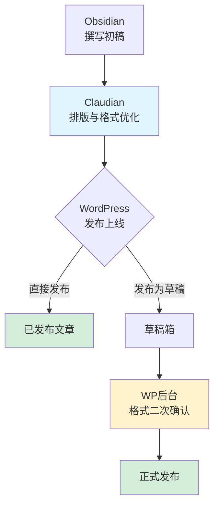

# Obsidian-huizhi

个人知识管理与笔记仓库。

## 📁 结构

| 目录             | 说明             |
| -------------- | -------------- |
| `Diary/`       | 日记             |
| `Blog/`        | 博客文章草稿         |
| `Study-Notes/` | 学习笔记           |
| `Project/`     | 项目文档           |
| `Essay/`       | 随笔与思考          |
| `AI/`          | AI 相关记录        |
| `Github/`      | GitHub-star 管理 |
| `Canvas/`      | 思维导图           |
| `Template/`    | 模板文件           |

## 🛠️ 工具

- **编辑器**: [Obsidian](https://obsidian.md/)
- **AI 助手**: Claudian
- **发布**: Obsidian WordPress 插件

## 📝 工作流

---

**最后更新**: 2026-01-24
